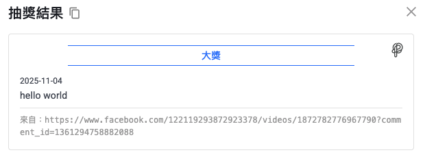

+++
title = '【2026 必備】FB抽獎工具推薦！臉書抽獎活動的流暢新體驗'
date = 2026-02-02T16:00:00+08:00
lastmod = 2026-02-02T16:00:00+08:00
draft = false
cover = { image = "cover.png" }
+++

舉辦一場熱絡的 Facebook 抽獎活動，往往是小編與行銷人員既期待又怕受傷害的時刻。期待的是粉絲的熱情互動、品牌曝光的飆升；害怕的則是活動結束後，面對成千上萬則留言的數據處理地獄。

當貼文留言數突破三位數甚至四位數時，傳統的「手動複製貼上」或「Excel 篩選」早已不敷使用。這不僅耗費了團隊寶貴的時間，更可能因為人為疏失導致抽獎結果不公，進而引發公關危機。

[Pitchat](https://app.pitchat.co?r=blog&utm_source=blog&utm_medium=blog&utm_campaign=facebook-giveaway-tool) 深刻理解行銷人的焦慮。我們設計的專業 FB抽獎工具，不只是一個隨機選號器，而是一套完整的活動管理解決方案。從活動開始前的規則設定，到活動結束後的名單產出，我們致力於提供最流暢、最無痛的使用者體驗，讓你將精力專注於與粉絲的互動上，而非繁瑣的數據整理。

---

## 為什麼你需要更現代化的臉書抽獎工具？

在追求效率與精準的社群時代，工具的選擇決定了活動的品質。Pitchat 專注於解決抽獎活動中的三個核心痛點，為你帶來截然不同的操作體驗：

### 1. 告別數據焦慮，擁抱海量互動

許多免費的 FB抽獎工具在面對大量留言時往往顯得力不從心，甚至發生網頁崩潰或漏抓留言的情況。這也是為什麼許多熱門活動的主辦方總是提心吊膽。

Pitchat 採用了企業級的資料處理架構。無論你的活動累積了多少留言，系統都能穩定、快速地完成抓取與分析。你可以放心地設計高互動性的活動，不必擔心技術門檻限制了你的創意。

### 2. 從單純的「抽獎」轉向「精準行銷」

抽獎不應該只是亂數選出幸運兒。一個成功的臉書抽獎活動，通常伴隨著明確的行銷目的：增加觸及、推廣特定關鍵字，或是鼓勵粉絲標記好友擴散。

我們提供了細緻的篩選機制，將這些行銷邏輯內化為簡單的設定選項。你可以輕鬆設定「必須包含特定關鍵字」或「標記特定數量好友」等條件，確保每一位得獎者都是真正符合活動規則的高價值互動者。

### 3. 用「透明度」建立品牌信任

在網路抽獎頻傳作弊疑雲的當下，如何讓粉絲「相信」抽獎結果是公平的？

Pitchat 堅持「流程透明」的設計哲學。我們不僅提供公開的抽獎運算邏輯，更讓你能一鍵產出包含詳細資訊的得獎名單。這種對公平性的堅持，能有效幫助品牌建立公信力，讓粉絲更願意參與未來的每一場活動。

> 延伸閱讀：[Pitchat 如何透過透明流程，為品牌建立信任](https://blog.pitchat.co/posts/how-pitchat-makes-lottery-transparent-/)

---

## 實戰體驗：五分鐘打造專業級抽獎流程

忘掉過去那些複雜難懂的操作介面。Pitchat 將 FB抽獎流程簡化為直覺的三個階段，即使是第一次使用也能立即上手。

### 階段一：安全無縫的連結

前往 [Pitchat 網站](https://app.pitchat.co?r=blog&utm_source=blog&utm_medium=blog&utm_campaign=facebook-giveaway-tool) 後，選擇「Facebook 抽獎」。系統會引導你進行官方授權登入。

我們深知資安的重要性，因此全程採用 Meta 官方標準 API 串接。這意味著你的帳號安全受到最高等級的保障，且我們只會讀取活動所需的必要公開資料。連結完成後，你所有的粉絲專頁與貼文將自動同步，讓你直接點選要進行抽獎的目標貼文。

### 階段二：直覺化的規則設定

這是將你的活動規則「翻譯」給系統聽的過程。我們將複雜的邏輯轉化為簡單的勾選與填空：

*   **基礎過濾**：一鍵排除重複留言或主辦方自己的回覆。
*   **資格審核**：輸入活動指定的關鍵字（如「我想獲得最新方案」），系統會自動剔除不符資格的留言。
*   **互動要求**：設定標記好友的數量門檻。
*   **獎項分配**：無論是一個大獎還是十個參加獎，都能在同一畫面中設定完成。

### 階段三：見證幸運時刻

當設定完成，只需點擊開始。系統會在幾秒鐘內完成成千上萬筆留言的審核與隨機抽選。

你將獲得一份清晰詳盡的得獎報告，包含得獎者的頭像、名稱、留言內容以及留言時間。這份報告支援一鍵複製，你可以直接將其貼到 Facebook 粉絲專頁的公告貼文中，向所有粉絲展示公開公正的結果。

---

## 配合你的行銷節奏：靈活的無限抽獎方案

不同的品牌有不同的活動頻率。為了讓各種規模的團隊都能無負擔地使用專業工具，我們推出了全新的彈性方案，讓預算花在刀口上。

### 單篇貼文無限抽：適合「重點突擊」

如果你不是常態性舉辦抽獎，而是配合新品上市或特殊節日（如雙11、過年）才舉辦大型活動，這個方案最適合你。

購買單一貼文的額度後，你可以針對該篇貼文進行無限次數的測試與正式抽獎。這讓你在正式公告前，有足夠的空間進行內部測試，確保每一個篩選條件都設定無誤。

### 30天無限抽：適合「密集宣傳期」

當品牌進入宣傳旺季，或是正處於粉絲成長衝刺期，可能會在一個月內密集舉辦多場活動。

這個方案提供 30 天內不限貼文數、不限抽獎次數的完全自由。不管是週週抽、日日抽，還是多個粉絲專頁同步開跑，都能即使應對，不再受限。

### 一年無限抽：適合「長期經營者」

對於將社群互動視為長期戰略的品牌、代理商或專業小編，這是最具成本效益的選擇。

即刻解鎖整年度的無限使用權。你不僅擁有了強大的工具，更獲得了隨時發起活動的自由。不用再為每次活動的工具預算申請流程煩惱，隨時捕捉社群熱點，即時推出抽獎活動。

---

## 讓工具成為你的行銷後盾

一場完美的臉書抽獎活動，應該結束在粉絲的歡呼與品牌的信譽提升上，而不是小編的加班地獄裡。

Pitchat 致力於提供最流暢、最可靠的 FB抽獎體驗，讓你從繁瑣的執行面中解放，專注於更有價值的創意規劃與粉絲互動。

現在就前往 [Pitchat 官網](https://app.pitchat.co?r=blog&utm_source=blog&utm_medium=blog&utm_campaign=facebook-giveaway-tool)，體驗更聰明、更優雅的社群行銷工作流。
