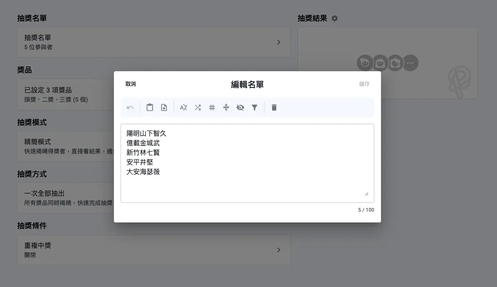
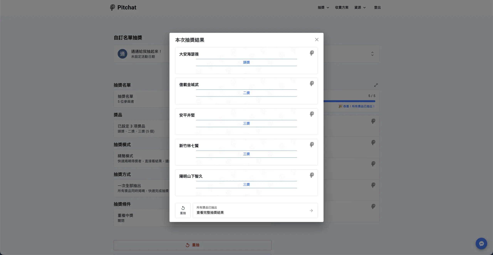

+++
title = '2026 最完整免費線上抽獎系統指南｜從尾牙到直播，一次搞懂所有場景'
date = "2026-01-25T10:00:00+08:00"
draft = false
cover = { image = "cover.png" }
+++

你是否曾經在公司尾牙時，看著主持人手忙腳亂地翻找紙籤抽獎？或是在學校班級活動中，擔心手動抽籤的公平性受到質疑？傳統抽獎或抽籤方式不僅耗時費力，還容易出現爭議。隨著數位科技的發展，**線上抽獎系統**與**線上抽籤系統**成為現代活動的最佳解決方案，讓抽獎過程更公平、更有效率，也更專業。

本文將完整介紹 **[Pitchat 免費線上抽獎系統](https://app.pitchat.co/lucky-draw?r=blog&utm_source=blog&utm_medium=blog&utm_campaign=free-online-lottery-system-guide)** 的所有功能、適用場景及使用教學，無論你是企業人資、活動企劃、社群小編、老師，還是婚禮新人，都能找到最適合的抽獎與抽籤解決方案。讓我們一次搞懂如何運用線上抽獎系統，讓你的活動環節順暢又精彩！

## 什麼是線上抽獎系統？

**線上抽獎系統**是一種透過網路平台，利用演算法自動隨機選取得獎者的數位工具。除了專業抽獎外，也常被作為**線上抽籤系統**使用。與傳統的紙籤抽獎、轉盤抽籤相比，數位化抽獎工具具有三大核心優勢：

### 公平性：加密隨機演算法確保公正

傳統抽獎方式常面臨「是否公平」的質疑，而線上抽獎系統可以根據不同場景採用不同的隨機演算法，例如：**CSPRNG（Cryptographically Secure Pseudo-Random Number Generator，加密安全偽隨機數生成器）**，這是常見的隨機演算法，確保每次抽獎結果完全隨機、不可預測，符合公平公正原則。

### 效率性：快速處理大量名單

想像一下，如果你需要從 500 位員工中抽出 50 位得獎者，或是需要隨機抽籤選出參與名單，手動作業會花多少時間？線上抽獎系統只需幾秒鐘就能完成，大幅提升活動流暢度。即使是數千人規模的大型活動，系統也能輕鬆應對。

### 透明度：結果可匯出

每次抽獎完成後，系統會即時顯示完整的中獎名單，並支援匯出功能（CSV、文字檔等格式）。這不僅方便後續通知得獎者，也讓整個過程更加透明可信。

簡單來說，**線上抽獎系統就是將傳統抽獎與抽籤數位化，讓過程變得更公平、更快速、更專業**。

## 線上抽獎系統的 6 大核心功能

一套好用的抽獎工具，應該具備哪些功能？以 **Pitchat 自訂名單抽獎系統** 為例，以下介紹 6 大核心功能，讓你完整了解這類工具的價值。

### 1. 自訂參與名單

靈活的名單匯入功能是線上抽獎系統的核心基礎。提供多種編輯與匯入方式，滿足不同使用者的操作習慣，包括：

- **手動輸入**：每行輸入一位參與者，適合小型活動
- **複製貼上**：從 Excel 或其他文件直接貼上名單，快速完成匯入
- **檔案上傳**：支援 CSV、TXT 等格式，一鍵上傳大量名單

系統最多支援 **10,000 位參與者**，無論是小型部門聚餐還是萬人大型活動，都能輕鬆應對。更棒的是，**100 人以內完全免費**，讓小型活動主辦方零成本享受專業抽獎/抽籤工具。

### 2. 多組獎項設定

傳統抽獎往往只能一次抽一個獎項，過程繁瑣。線上抽獎系統讓你可以**一次設定多組獎項**，例如：

- 頭獎：沖繩機加酒 × 1 名
- 二獎：現金 $10,000 × 3 名
- 三獎：禮券 $500 × 10 名
- 四獎：CD-PRO2 × 20 名

每組獎項都能自由設定名稱與數量，系統會依序抽出各獎項得主。而且，還可以**自動排除已中獎者**，確保同一個人不會重複中獎，讓獎品分配更公平。

### 3. 公平隨機演算法

這是線上抽獎系統的核心價值。採用 **CSPRNG（加密安全偽隨機數生成器）**，這種演算法廣泛應用於加密、安全認證等領域，具有以下特性：

- **真正的隨機性**：每次抽獎結果無法預測
- **不可操控**：即使是系統管理員也無法干預結果
- **符合標準**：符合常見的公平抽獎標準

這讓你的抽獎活動不僅公平，更能經得起所有參與者的檢驗。

### 4. 不同模式介面設計

**Pitchat 自訂名單抽獎**目前提供兩種顯示模式，滿足不同場景需求：

#### 精簡模式：適合快速抽獎、線上活動

- 簡潔的介面設計，專注於功能操作
- 快速完成設定與抽獎
- 適合辦公室環境、小型活動、線上活動

#### 派對模式：適合現場活動、大螢幕投影

- **炫目視覺特效與音效**，營造熱鬧抽獎氛圍
- 支援投影機或大螢幕顯示
- **全螢幕顯示模式**，投影效果絕佳
- 適合公司尾牙、年會、婚禮現場、直播活動

想像一下，在公司尾牙的舞台上，大螢幕投影著抽獎畫面，搭配有趣的音效與特效，每位得獎者的名字逐一跳出——這樣的抽獎環節，絕對能讓全場氣氛嗨翻天！

### 5. 三種抽獎方式

除了顯示模式的選擇，系統還提供多種抽獎方式，並可自由選擇獎品控制流程：

- **一次全抽**：所有獎項一次抽出，快速產出完整結果，適合時間有限的場合
- **逐項抽出**：逐組抽出（通常由小獎項開始），適合階段性公布結果
- **逐個獎品抽**：一次抽一個得獎者，**搭配派對模式效果最佳**，讓每個得獎時刻都充滿儀式感和驚喜

### 6. 結果匯出功能

抽獎結束後，系統提供：

- **即時顯示中獎名單**：清楚呈現每組獎項的得獎者
- **支援結果匯出**：可下載為 CSV 或文字檔，方便後續通知得獎者或存檔備查

這些功能讓你能輕鬆保存抽獎結果，提升活動的專業度。

## 線上抽獎工具適用 8 大場景

線上抽獎系統的應用範圍比你想像的更廣！以下介紹 8 種常見場景，看看你的需求是否也在其中：

### 1. 公司尾牙/春酒抽獎

**場景描述**：每年最受期待的員工福利抽獎、摸彩活動，從小家電到大獎汽車，獎品豐富但名單龐大。

**線上抽獎優勢**：

- 快速處理數百位甚至上千位員工名單
- 公平公正，避免「內定」質疑
- 支援多組獎項，從頭獎到安慰獎一次搞定

> **派對模式應用**：
> 在尾牙現場，將抽獎系統投影在大螢幕上，開啟派對模式的音效與炫目特效。搭配「逐個獎品抽」方式，讓每位得獎者的名字逐一跳出，全場一起倒數、歡呼——這樣的抽獎環節，保證讓氣氛瞬間嗨翻，成為尾牙的最高潮！

### 2. 婚禮遊戲抽獎

**場景描述**：婚禮中的賓客互動遊戲、增添趣味的遊戲環節，或是謝親恩環節的小驚喜。

**線上抽獎優勢**：

- 增添婚禮趣味，讓賓客更有參與感
- 公平隨機，讓每位賓客都有中獎機會
- 快速完成，不拖延婚禮流程

> **派對模式應用**：
> 將抽獎畫面投影在婚禮螢幕上，搭配浪漫的音效特效，讓賓客一起參與這個緊張刺激的抽獎過程。無論是抽出上台互動的幸運賓客，或是抽出小禮物的得主，派對模式都能為婚禮增添更多歡樂氣氛。

### 3. 社群媒體活動

**場景描述**：Facebook、Instagram、Threads 等社群平台的粉絲抽獎、促銷活動。

**線上抽獎優勢**：

- 整理參與者名單後，一鍵匯入系統
- 公開透明的抽獎過程，提升粉絲信任
- 可截圖或錄影抽獎過程，公告結果更有說服力

> **實際應用**：
> 將「按讚留言分享」的參與者名單整理成文字檔，上傳至系統後即可抽出幸運得主。使用精簡模式快速操作，或錄製派對模式的抽獎過程發布在社群上，都是很好的做法。

### 4. 直播互動抽獎

**場景描述**：直播主在 YouTube、Facebook、Twitch 等平台進行的即時抽獎活動。

**線上抽獎優勢**：

- 即時操作，現場立即抽出得獎者
- 炒熱直播氣氛，增加觀眾互動
- 透明公正，避免「假抽獎」質疑

> **派對模式應用**：
> 直播主可以分享抽獎系統的視窗畫面，讓線上觀眾看到完整的抽獎過程。即使是線上觀眾也能感受到現場般的刺激感。「逐個獎品抽」的方式，更能拉長互動時間，讓每位得獎者都有專屬的「高光時刻」。

### 5. 學校班級分組

**場景描述**：老師需要隨機分組、抽選值日生、或是進行課堂抽籤活動。

**線上抽獎優勢**：

- 公平分配，避免學生爭議，是最簡單的**教室抽籤工具**
- 快速完成，節省上課時間
- 可重複使用，適合經常性的抽籤、分組需求

> **實際應用**：
> 輸入全班學生名單，設定要抽出的人數或組別，系統會自動隨機抽選。使用精簡模式簡單快速，也可以用派對模式增添課堂趣味。

### 6. 門市抽獎促銷

**場景描述**：實體店面舉辦的顧客抽獎活動，如週年慶抽獎、滿額贈活動。

**線上抽獎優勢**：

- 提升專業形象，讓顧客感受店家用心
- 快速執行，不讓顧客久等
- 現場透明抽獎，增加顧客信任

> **實際應用**：
> 將參與抽獎的顧客名單（或編號）輸入系統，現場使用派對模式抽獎，讓顧客見證整個過程。音效與特效更能營造熱鬧的促銷氛圍，吸引更多人潮。

### 7. 年會/大型活動

**場景描述**：企業年會、產品發表會、大型展演等需要處理大量參與者的場合。

**線上抽獎優勢**：

- 支援大量參與者
- 多組獎項設定，滿足複雜的抽獎需求
- 專業形象，彰顯企業實力

> **派對模式應用**：
> 大型活動絕對是派對模式的主場！將抽獎系統投影在舞台大螢幕上，搭配專業的音響設備，開啟震撼音效與炫目特效。「逐個獎品抽」的方式讓每個得獎時刻都充滿儀式感，全場的目光聚焦在抽獎環節，營造出專業又熱鬧的活動氣圍。

### 8. 節慶聚會抽獎

**場景描述**：中秋烤肉、春節聚會、生日派對等親友團聚時的趣味抽獎。

**線上抽獎優勢**：

- 增添娛樂性，讓聚會更有趣
- 凝聚氣氛，大家一起參與
- 簡單好用，不需要事前準備紙籤

> **實際應用**：
> 現場快速輸入參與者名字，設定小獎品（如紅包、小禮物），使用派對模式讓抽獎成為聚會的亮點環節。

## 如何使用線上抽獎系統？完整教學

看完這麼多功能與場景，你可能會想：「這套系統聽起來很厲害，但會不會很複雜？」別擔心！以下提供完整的使用教學，只需 6 個步驟，就能輕鬆完成抽獎。

### Step 1：登入

1. 前往 [Pitchat 線上抽獎工具](https://app.pitchat.co?r=blog&utm_source=blog&utm_medium=blog&utm_campaign=free-online-lottery-system-guide)
2. 點擊「立即使用」或「登入」
3. 使用 Email 接收 OTP（一次性密碼）快速登入
4. **免費帳號即可使用**（100 人以內名單完全免費）

整個登入過程不到 1 分鐘，無需填寫繁瑣資料，也不需要綁定信用卡。

### Step 2：輸入參與者名單

系統提供三種名單匯入方式，選擇最適合你的：

**方式一：手動輸入**

- 在名單輸入框中，每行輸入一位參與者的名字
- 適合小型活動（10-20 人以內）

**方式二：複製貼上**

- 從其他文件複製名單
- 直接貼上到輸入框即可
- 適合中型活動（20-100 人）

**方式三：上傳檔案**

- 支援 CSV、TXT 純文字檔案
- 名單格式：每行一位參與者
- 適合大型活動（100 人以上）

**注意事項：**

- 確認名單中沒有重複的名稱（除非你允許同一人有多次中獎機會）
- 檢查名單格式正確，避免多餘內容或符號

### Step 3：設定獎項內容

1. 點擊「新增獎項」按鈕
2. 設定獎項名稱（例如：頭獎 iPhone、二獎禮券）
3. 設定該獎項的中獎人數
4. 可以新增多組不同獎項
5. 獎項可隨時編輯或刪除

**提醒：** 設定完成後，可以在開始抽獎前隨時調整獎項內容。

### Step 4：選擇抽獎模式與方式

根據你的場景選擇合適的模式：

**選擇顯示模式：**

- **精簡模式**：
  - 簡潔介面，適合線上作業、辦公室環境
  - 快速完成抽獎，不需要額外設定
  - 適合小型活動、社群抽獎、內部使用

- **派對模式**：
  - 音效 + 視覺特效，適合現場投影、大螢幕顯示
  - 建議使用場景：尾牙、年會、婚禮、直播等需要營造氣氛的場合
  - 支援全螢幕顯示，投影效果絕佳
  - 讓抽獎成為活動的最大亮點！

**選擇抽獎方式：**

- 一次全抽：所有獎項一次抽出
- 逐項抽出：逐組抽出（通常由小獎項開始），可自由選擇獎品控制流程
- 逐個獎品抽：一次抽一個得獎者（**搭配派對模式效果最佳**），讓每位得獎者都享受專屬的中獎時刻

### Step 5：開始抽獎

1. 確認所有設定無誤後，點擊「開始抽獎」按鈕
2. 系統自動使用加密隨機演算法抽選
3. 抽獎過程完全自動化，無需人工介入
4. 即時顯示中獎名單

如果你選擇派對模式，這時候現場音效與特效會啟動，讓整個抽獎過程充滿驚喜與刺激！

### Step 6：查看與匯出結果

抽獎完成後：

1. 畫面會即時顯示完整的中獎名單（按獎項分類）
2. 點擊「匯出結果」可下載為 CSV 或文字檔
3. 可將結果截圖或分享給參與者
4. 建議立即匯出保存，以便後續通知得獎者

整個過程就是這麼簡單！即使是第一次使用，也能在 5 分鐘內完成所有設定並開始抽獎。

## 免費 vs 付費方案比較

Pitchat 自訂名單抽獎提供靈活的方案選擇，無論你的活動規模大小，都有適合的選項。

### 免費方案（100 人以內）

我們的免費方案，讓小型活動也能享受專業抽獎工具：

**完全免費**，無需綁定信用卡，無隱藏費用  
**支援所有核心功能**（自訂名單、多組獎項、切換抽獎模式、三種抽獎方式）  
**適合場景**：部門聚餐、小型社群抽獎、班級活動、粉絲互動  
**唯一限制**：參與者名單上限 100 人

對於大多數小型活動來說，免費方案已經綽綽有餘！

### 付費方案（100 人以上）

當你的活動規模擴大，我們提供三種付費方案：

**輕用量版**

- 適合場景：部門聚餐（100-500 人）、粉絲抽獎、中小型活動
- 彈性使用，按需購買

**中用量版**

- 適合場景：婚禮（數百位賓客）、尾牙（中型企業）、展演活動
- 支援更大規模的參與者
- 適合需要多次使用的場合

**高用量版**

- 適合場景：大型年會（千人以上）、高流量直播活動、多場次使用
- 最高可支援 10,000 位參與者
- 適合企業用戶或專業活動公司

### 特殊需求怎麼辦？

如果你的活動規模超過 10,000 人，或有其他特殊需求，歡迎聯繫我們的客服團隊，我們將為你量身打造專屬方案。

## 常見問題 FAQ

在使用線上抽獎系統前，你可能還有一些疑問。以下整理最常見的問題，幫助你快速了解：

### Q1：抽獎結果真的公平嗎？

**A：** 我們採用 **CSPRNG（Cryptographically Secure Pseudo-Random Number Generator，加密安全偽隨機數生成器）**，這是專業的隨機演算法，廣泛應用於加密、安全認證等領域。每次抽獎結果完全隨機、不可預測，即使是系統管理員也無法干預結果，確保 100% 公平公正。

### Q2：免費版有功能限制嗎？

**A：** 免費版（100 人以內）提供**完整功能**，包括自訂名單、多組獎項、精簡模式與派對模式、三種抽獎方式、結果匯出等。唯一的限制是參與者人數上限為 100 人。如果你的活動規模在 100 人以內，使用免費版就能享受所有專業功能，完全不打折扣！

### Q3：可以避免重複中獎嗎？

**A：** 可以！系統提供「重複中獎」設定，預設為關閉，但你可以自由設定是否開啟。當你設定多組獎項時（如頭獎、二獎、三獎），系統會自動排除已經中過獎的人，確保同一人不會重複中獎。

### Q4：支援哪些檔案格式匯入？

**A：** 系統支援 CSV（逗號分隔值） 與 TXT（純文字檔）兩種格式。名單格式很簡單：每行一位參與者的名字即可。你可以用 Excel 編輯後另存為 CSV，或用記事本建立 TXT 檔案，系統會自動解析並匯入名單。

### Q5：抽獎結果可以保存嗎？

**A：** 可以！每次抽獎完成後，系統會即時顯示完整的中獎名單，你可以點擊「匯出結果」下載為 CSV 或文字檔。建議抽獎完成後立即匯出保存，方便後續通知得獎者或存檔備查。

### Q6：最多可以設定幾組獎項？

**A：** 系統支援最多 **100 個獎項**，總計最多 **1,000 個獎品**。你可以自由設定頭獎、二獎、三獎等多組獎項，系統會依序抽出各獎項得主。這個規模足以應對絕大多數的活動需求。

### Q7：萬人以上活動怎麼辦？

**A：** 目前系統支援最多 10,000 位參與者。如果你的活動規模超過 10,000 人，歡迎聯繫我們的客服團隊，我們將為你評估需求。

### Q8：派對模式適合什麼場合？

**A：** 派對模式非常適合需要**營造現場氣氛**的場合，包括公司尾牙、年會、婚禮、直播活動、門市促銷等。搭配投影機或大螢幕顯示，開啟音效與視覺特效，能讓抽獎環節成為活動的最大亮點！建議搭配「逐個獎品抽」方式使用，讓每位得獎者都享受專屬的中獎時刻，效果最佳。

## 結論：讓抽獎成為活動的亮點

傳統的抽獎方式已經不符合現代活動的需求，線上抽獎系統以**公平、快速、專業**的優勢，成為各類活動的標準配備。無論你是企業人資準備尾牙抽獎、新人策劃婚禮遊戲、社群小編舉辦粉絲互動，還是老師需要隨機分組抽籤，線上抽獎系統都能讓你的活動環節更順暢、更精彩。

**Pitchat 自訂名單抽獎系統**提供：
**100 人以內完全免費**，讓小型活動也能享受專業工具  
**多種模式介面設計**，滿足所有活動場景需求  
**公平隨機演算法**，確保每次抽獎結果公正透明  
**完整功能支援**，從名單匯入到結果匯出，一站式解決所有需求

不要再讓繁瑣的手動作業成為活動的負擔。立即使用 **Pitchat 線上抽獎系統**，體驗專業工具帶來的便利與效率！

**👉 [立即免費使用 Pitchat 線上抽獎系統](https://app.pitchat.co/lucky-draw?r=blog&utm_source=blog&utm_medium=blog&utm_campaign=free-online-lottery-system-guide)**

登入即可開始使用，讓我們一起讓活動環節變得更簡單、更公平、更有趣！

---

### 延伸閱讀

除了自訂名單抽獎，Pitchat 還提供多種社群平台抽獎工具：

- [Instagram 抽獎工具](https://app.pitchat.co/instagram?r=blog&utm_source=blog&utm_medium=blog&utm_campaign=free-online-lottery-system-guide) - IG留言抽獎
- [Facebook 抽獎工具](https://app.pitchat.co/facebook?r=blog&utm_source=blog&utm_medium=blog&utm_campaign=free-online-lottery-system-guide) - 粉專貼文抽獎
- [Threads 抽獎工具](https://app.pitchat.co/threads?r=blog&utm_source=blog&utm_medium=blog&utm_campaign=free-online-lottery-system-guide) - 脆抽獎
- [YouTube 抽獎工具](https://app.pitchat.co/youtube?r=blog&utm_source=blog&utm_medium=blog&utm_campaign=free-online-lottery-system-guide) - YT影片留言抽獎

有任何問題或建議？歡迎聯繫我們：[contact@pitchat.co](mailto:contact@pitchat.co)
