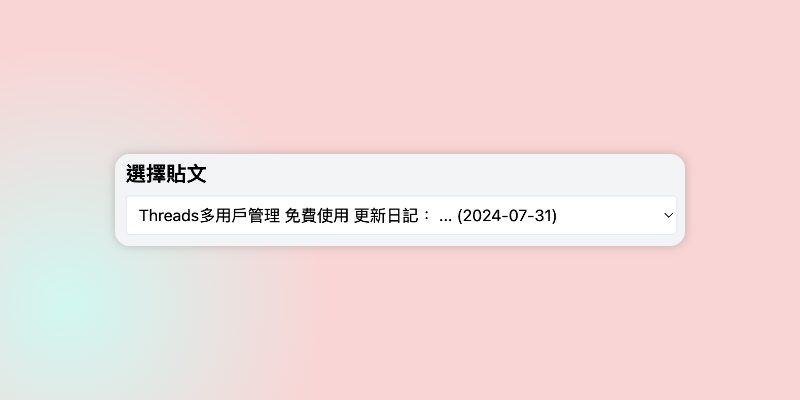
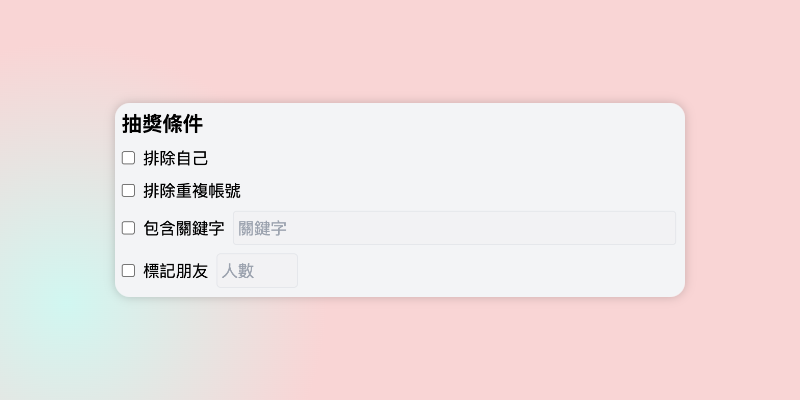
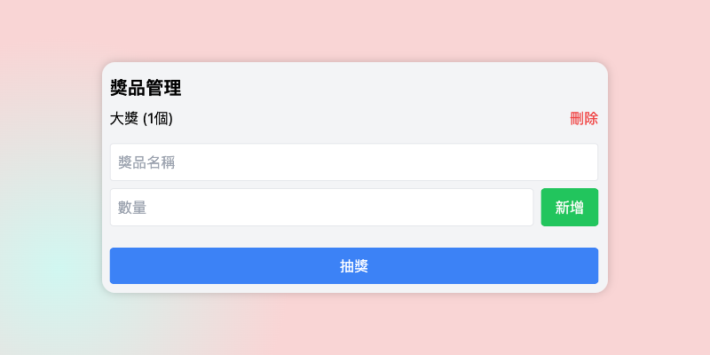
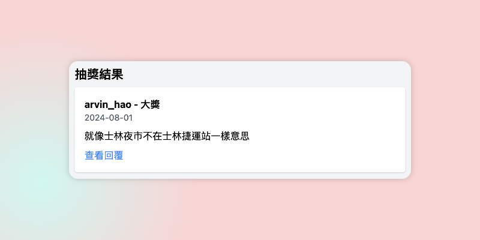

+++
title = '你也在找免費的Threads抽獎工具嗎？'
date = 2024-07-14T07:07:07+01:00
draft = false
cover = { image = "lottery1.png" }
+++
在社交媒體行銷中，抽獎活動是一種極為有效的方式來增加互動和吸引新粉絲。隨著Threads平台的興起，許多品牌和內容創作者都在尋找合適的工具來舉辦抽獎活動。今天，我們要介紹一個免費且功能強大的Threads抽獎工具，它將幫助你輕鬆管理和執行抽獎活動。

## 為什麼選擇這個Threads抽獎工具？

1. **完全免費**：無需支付任何費用，就能使用專業級的抽獎功能。
2. **使用者友善**：直觀的界面設計，讓你輕鬆上手。
3. **多樣化的抽獎條件**：可以根據你的需求設置各種抽獎條件。
4. **公平公正**：採用隨機抽選算法，確保抽獎結果的公平性。
5. **結果導出**：一鍵導出抽獎結果，方便後續的獎品發放。

## 主要功能介紹

### 1. 選擇貼文

你可以輕鬆選擇要進行抽獎的Threads貼文。系統會自動載入你的貼文列表，包含貼文內容預覽和發布日期，方便你快速找到目標貼文。

### 2. 自定義抽獎條件

這個工具提供了多種抽獎條件設置，包括：

- 排除自己參與抽獎
- 排除重複帳號
- 包含特定關鍵字
- 要求標記朋友（可設置標記人數）

這些靈活的選項讓你能夠根據活動需求，精確控制參與抽獎的資格。

### 3. 獎品管理

你可以輕鬆添加多個獎品，每個獎品可以設置不同的數量。這個功能特別適合有多重獎項的抽獎活動，讓整個過程更加有趣和吸引人。

### 4. 一鍵抽獎

設置完所有條件後，只需點擊「抽獎」按鈕，系統就會自動從符合條件的回覆中隨機選出獲獎者。整個過程透明公正，讓參與者更有信心。

### 5. 結果展示與發布

抽獎結果會立即顯示，包含獲獎者的用戶名、回覆內容和時間。你還可以一鍵將結果導出並發布到Threads，讓整個抽獎過程更加公開透明。

## 使用技巧

1. **設置明確的抽獎規則**：在使用工具前，先在貼文中清楚說明參與規則，如關鍵字、標記朋友等要求。
2. **合理設置獎品數量**：根據預期的參與人數，設置適當的獎品數量，以提高中獎率和參與熱情。
3. **及時公布結果**：使用工具的「發布中獎名單」功能，迅速將結果分享到Threads，提高活動的公信力。

## 如何開始使用

1. 訪問 [Pitchat 服務首頁](https://pitchat.co)
2. 點擊「登入」按鈕
3. 如果你還沒有帳號，請參考我們的 [註冊教學](https://blog.pitchat.co/posts/how-to-register-pithcat/) 來創建一個新帳號
4. 登入後，你就可以開始使用這個強大的Threads抽獎工具了！

## 結語

這個免費的Threads抽獎工具不僅簡化了抽獎流程，還能夠幫助你提高粉絲互動、增加關注度。無論你是小型創作者還是大品牌，都能輕鬆舉辦專業級的抽獎活動。現在就開始使用這個工具，讓你的Threads營銷策略更上一層樓吧！

記住，成功的抽獎活動不僅在於工具，更在於你如何與粉絲互動。善用這個工具，結合有趣的內容和吸引人的獎品，相信你一定能夠在Threads平台上創造出令人驚艷的營銷活動！

[立即開始你的第一次Threads抽獎活動](https://pitchat.co)