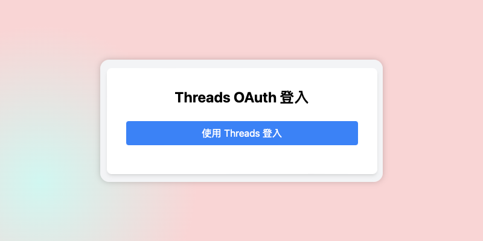
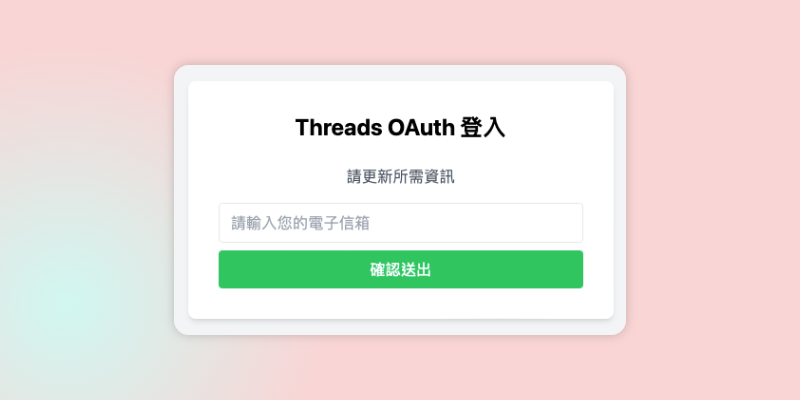

+++
title = '如何快速註冊Pitchat'
date = 2024-07-14T07:07:07+01:00
draft = false
cover = { image = "register1.png" }
+++
[Pitchat](https://pitchat.co) 是一個由台灣獨立開發者開發，專用於Threads行銷使用的輔助工具，內容涵蓋了**Threads數據分析**、Threads抽獎工具、Threads排程發文與Threads內容發想的專業行銷工具。

## 免費版本功能

免費版本可以享有以下即時數據顯示：

1. **過去30日的數據摘要**
    - 包含愛心數、被回應數、被轉發數、被引用數以及個人資料觀看次數
2. **前五大地理粉絲分布**
3. **粉絲性別分布**
4. **粉絲年齡分布**
5. **個人資料觀看次數趨勢**

我們承諾並不會儲存或分析您的數據，這些數據只屬於您並且讓您能夠分析深入了解您的Threads表現，做出明智的行銷決策。

## 註冊步驟

只要兩個步驟，免綁定信用卡即可註冊使用。

### 步驟一

進入 [Pitchat](https://pitchat.co) 點擊免費使用並點擊Threads OAuth登入。

> 請注意這個步驟並不會取得您的帳號密碼

### 步驟二

為避免濫用，請輸入您的電子信箱，即可開始使用服務。

## 深入了解Threads數據分析的重要性

**Threads數據分析**能夠幫助您：

- 確認受眾的地理位置，針對特定地區進行精準行銷
- 分析粉絲的性別和年齡分布，調整內容策略
- 透過趨勢圖了解受歡迎的內容類型，提升互動率

使用Pitchat的Threads數據分析功能，讓您的行銷策略更加精準有效，提升品牌影響力和粉絲參與度。立即註冊Pitchat，享受專業的Threads行銷服務！