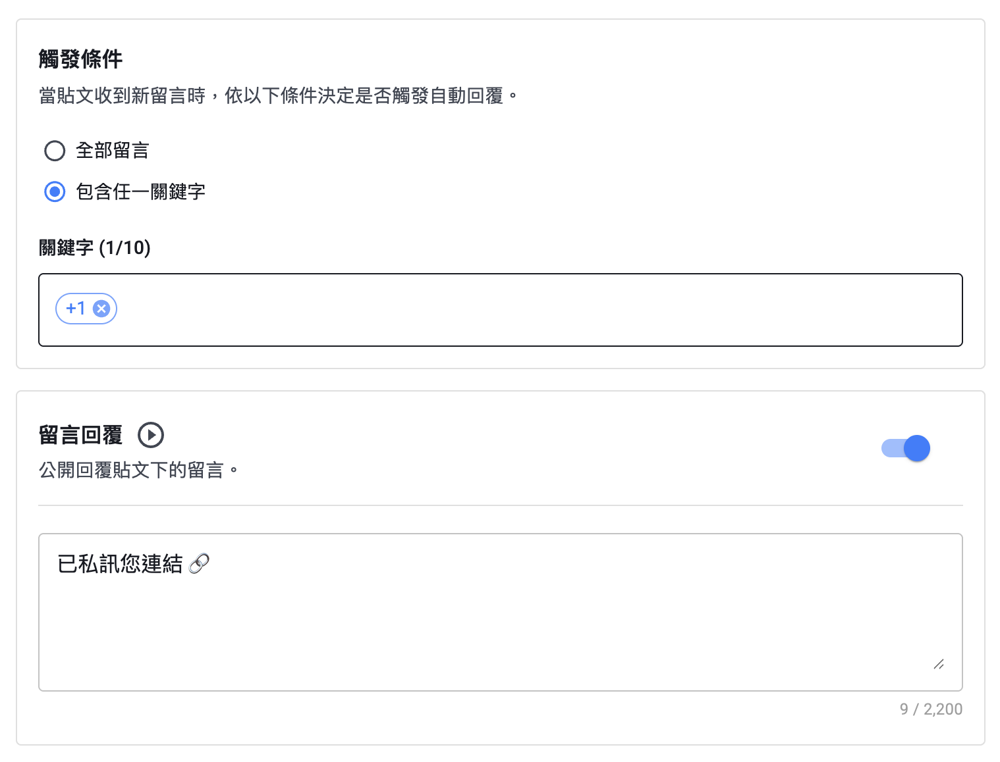

+++
title = 'IG 自動回覆怎麼設定？2026 最完整 Instagram 留言與私訊自動化工具教學'
date = 2026-05-14T07:07:07+01:00
draft = false
cover = { image = "ig-auto-reply.png" }
+++

**想找 IG 自動化神器？這篇一次告訴你如何設定 IG 自動回覆、IG 關鍵字回覆以及 IG 私訊自動化！**

---

## 為什麼小編都在用「IG 自動回覆」？

經營 IG 的你，是不是常遇到這些崩潰狀況：

- 辦抽獎活動，留言瞬間灌爆好幾千則，根本回到手軟
- 發限動或貼文說「留言索取優惠連結」，結果整個晚上都在複製貼上回小盒子
- 粉絲問問題，但因為你剛好在忙沒馬上回，人就跑了

對台灣的創作者、KOL 或是品牌小編來說，**在 Instagram 上跟粉絲互動是養粉最快的方式**。可是當帳號做起來、流量變大之後，人工一則一則回覆真的太沒效率了。

這時候，**IG 自動回覆**（或稱 IG 自動化）就是你的救星。這篇文章會用最白話的方式，教你怎麼用這套工具，幫你省下大把時間，還能讓互動率翻倍！

---

## 到底什麼是 IG 自動化？

簡單來說，IG 自動回覆就是透過 Instagram 官方的 API 串接出來的功能。只要粉絲在你的貼文底下留言，系統就會**自動幫你回覆留言，或是直接傳 IG 私訊給對方**，完全不用你自己動手。

而且大家最擔心的「會不會被鎖帳號？」答案是不會！因為 Pitchat 的自動化工具是走 Meta 官方認證的合法管道，**完全符合 Instagram 規定**，不用擔心被懲罰或封鎖。

---

## IG 自動回覆是怎麼觸發的？

你可以自己設定「什麼情況下系統要幫你回覆」。最常見也最好用的就是這個：

### 關鍵字回覆（IG 關鍵字設定）

只要粉絲的留言裡**有你指定的關鍵字**，就會觸發自動回覆。你可以設定好幾組字，只要中一個就啟動。

**什麼時候用最好？**
- 貼文寫：「留言『+1』，小編把優惠碼私給你」
- 分享乾貨時：「留言『想學』，自動發送教學簡報」
- 檔期活動多：「留言A給A連結，留言B給B連結」

> **實戰舉例：** 你的貼文寫「留言『我要連結』，直接送到你小盒子！」，只要粉絲留言打出這四個字，系統就會光速把帶有購買連結的 IG 私訊傳過去。

---

## 觸發之後，系統會怎麼幫我回？

當條件觸發後，系統可以幫你做這兩件事（可以單選也可以全選）：

### 1. 直接在貼文底下「公開回覆」

也就是直接在粉絲的留言下面回覆，大家都看得到。

- **好處**：留言數跟回覆數直接 double，對 IG 演算法超加分，能讓貼文觸及率更高！
- **用法**：設定親切的罐頭回覆，像是「馬上處理！」、「連結飛過去囉～」。

**範例：**
> 粉絲：「+1 想知道連結！」
> 系統自動回：「感謝支持！小編已經把詳細資訊丟到你小盒子囉 ^^」

### 2. 直接發「IG 私訊 (DM)」給他

系統會直接發一則私訊到對方的 IG 裡。

在 Pitchat 裡，你可以把私訊設計得很漂亮，包含：
- 吸引人的標題跟說明文字
- 可以直接點擊的按鈕（直接導到官網、蝦皮購物車或報名表單）

**私訊長這樣：**

---

## 兩段式私訊流程：不怕踩到 Meta 地雷

Instagram 有個很嚴格的規定：**一定要用戶先理你，你才能傳私訊給他**。

為了100%安全過關，PitChat 的 IG 自動化系統設計了超聰明的**兩段式流程**：

**第一階段：引導訊息（Private Reply）**

粉絲留言後，系統會先在對話視窗裡丟出一個「只有他自己看得到」的訊息，上面會有個按鈕（例如：點我領取連結）。

**第二階段：正式發送完整 IG 私訊**

只要粉絲**點了那個按鈕**，就代表他同意接收訊息了，這時系統才會把完整的活動內容或連結傳給他。

這樣做有幾個超棒的優點：
- 完全照著 Meta 的規矩走，帳號超安全
- 確保拿到連結的人是真的有興趣，轉換率更高
- 粉絲看到按鈕通常都會好奇點一下，互動效果超好

---

## 綁定「追蹤確認」：沒追蹤就不給領！

辦活動最怕遇到抽完獎就退追的幽靈帳號。我們的系統有**追蹤確認（Follow Check）**功能，發送 IG 私訊前，會先檢查對方有沒有追蹤你。

- **有追蹤**：直接把好康私訊給他。
- **沒追蹤**：系統會提醒他「哎呀還差一步！先追蹤我們，馬上就把連結送上！」

對於想要快速漲粉的 KOL 或品牌來說，這招真的超好用！

---

## 防狂刷機制：不會對同一個人連發訊息

怕粉絲一直留言、系統一直狂回變洗版嗎？不用擔心，我們內建了保護機制：

- **防重複回覆**：同一個粉絲在同一篇貼文重複留言，系統只會回他一次。
- **速率控制**：同一個人在 60 秒內狂刷留言，也只會收到一次私訊，不會被你的機器人轟炸。
- **防衝突機制**：如果留言已經被批次回覆處理過了，系統會聰明地跳過。

---

## 後台數據一目了然

用 IG 自動化當然要看成效！每一次自動回覆都會記錄在後台，你可以隨時查看：

- 哪幾個關鍵字最多人留？
- 公開留言跟 IG 私訊有沒有成功送出？
- 來留言的粉絲帳號是哪些？

這能幫你快速抓到粉絲的口味，下次辦活動就更知道怎麼玩。

---

## 方案費用：從免費試用到吃到飽都有

| 方案 | 費用 | 可以用在哪裡？ | 可以用多久？ | 可以傳幾則私訊？ |
|------|------|----------|--------|----------|
| 免費試用 | $0 | 單篇貼文 | 365 天 | 100 則 |
| 單篇貼文方案 | $199 元 | 單篇貼文 | 30 天 | **無上限** |
| 帳號吃到飽方案 | $399 元 / 月 | 整個帳號所有貼文 | 30 天 | **無上限** |

**該選哪一種？**

- **偶爾辦抽獎的創作者**：買 $199 的單篇方案最划算，活動期間內無限次數幫你回。
- **行銷公司、品牌電商**：直接包月 $399 吃到飽！帳號裡所有貼文都能同時設定不同的自動回覆，CP 值爆表。

[👉 點我進入 Pitchat ，馬上領取免費試用額度！](https://app.pitchat.co/workspace)

---

## 別人怎麼玩 IG 自動化？台灣品牌實戰案例

### 玩法一：電商新品/爆品促銷

**怎麼做：**
1. 發佈超生火的新品短影音 (Reels) 或圖文
2. 內文寫「留言『買買買』，小編立刻把隱藏折扣碼私給你」
3. 設定關鍵字觸發 IG 私訊，並放上購物車連結按鈕
4. 同時開啟貼文底下自動留言：「折扣碼已發送，趕快去小盒子收信囉！」

**成效：** 貼文留言大爆發，演算法推波助瀾，還能精準把人導到官網結帳！

---

### 玩法二：健身房/實體店面辦抽獎

**怎麼做：**
1. 貼文寫「標記 2 位想一起變瘦的朋友，抽免費一個月會籍！」
2. 設定條件為「@tag 至少 2 人」
3. 系統自動私訊：「感謝參加！記得追蹤我們才算成功喔！」
4. 開啟「追蹤確認功能」，確保只有粉絲才能抽獎。

**成效：** 靠粉絲拉粉絲，觸及率像病毒一樣擴散，追蹤數跟著水漲船高。

---

### 玩法三：KOL 業配帶貨

**怎麼做：**
1. KOL 發布合作貼文，提到「想要專屬優惠，留言『+1』」
2. 關鍵字觸發，自動把專屬折扣碼跟品牌官網連結用 IG 私訊傳出
3. 限定只有追蹤 KOL 與品牌帳號的人才能領取。

**成效：** 品牌可以精準追蹤有多少人因為這篇貼文領了折扣碼，KOL 的帶貨力道清清楚楚。

---

## 大家最常問的 FAQ

**Q：用 IG 自動回覆會被鎖帳號嗎？**
A：絕對不會！Pitchat 的自動化功能是接 Meta 官方開放的 API，完全符合規定，可以安心使用。

**Q：IG 私訊的內容可以自己改嗎？**
A：當然可以！你可以自訂標題、內文，還可以加上專屬的連結按鈕。

**Q：吃到飽方案可以設定幾篇貼文？**
A：沒有限制！只要是你帳號底下的貼文，想設幾篇就設幾篇，30 天內私訊傳到飽。

**Q：可以同時在貼文下回覆，又傳 IG 私訊給他嗎？**
A：可以的，這兩個功能可以同時開，雙管齊下效果更好！

---

## 結語：讓系統幫你賺時間跟業績

對台灣的社群編輯、KOL 跟品牌來說，**IG 自動回覆**早就不是什麼黑科技，而是把活動效益極大化的必備武器。

從設定關鍵字、標記人數門檻，到超聰明的兩段式 IG 私訊，一條龍的自動化流程幫你接住每一個對你有興趣的客人，還能維持超有溫度的互動感。

別再浪費時間手動回訊息了，現在就試試看，讓下一次的活動互動率直接翻倍吧！

[👉 點這裡進入 Pitchat 工作區，只要 3 分鐘就能設好你的 IG 自動回覆！](https://app.pitchat.co/workspace)

---

*想看更多 IG 自動化實用功能，或是想免費試用看看？歡迎到 [Pitchat 官網](https://pitchat.co) 了解更多喔！*
