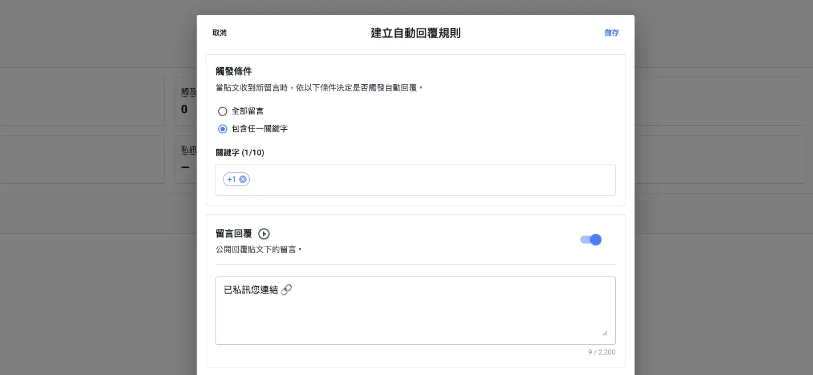
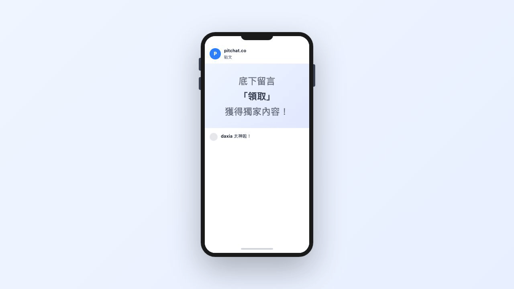
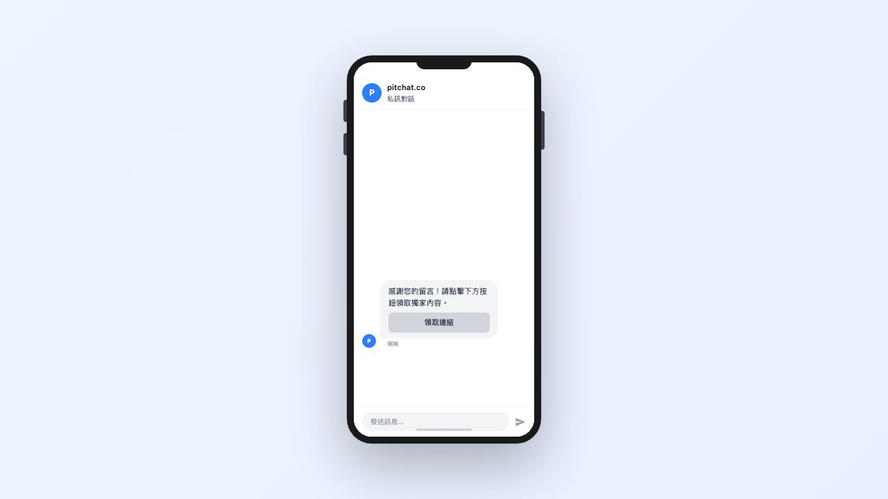
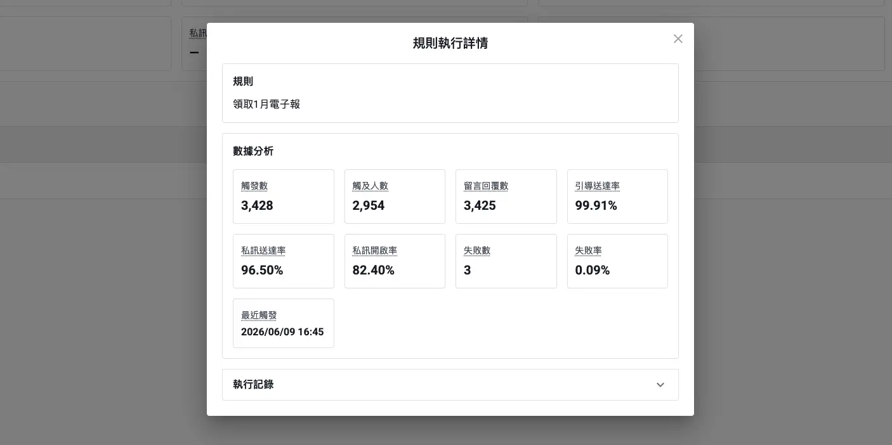
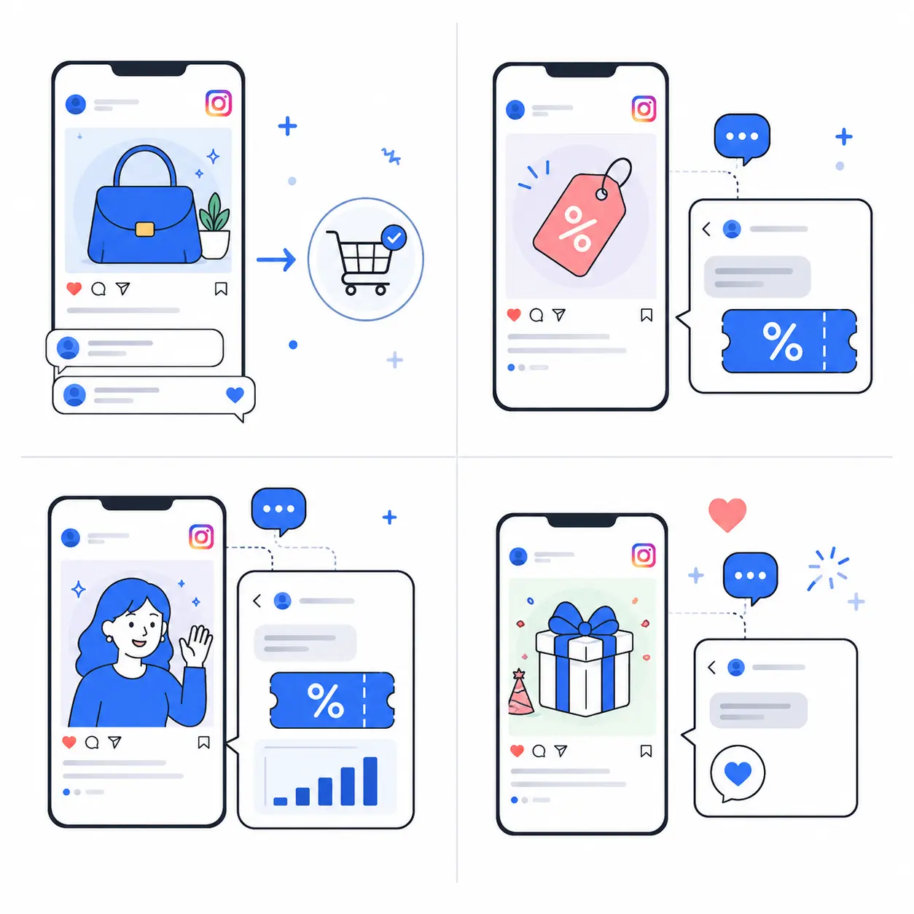

+++
title = 'IG 自動回覆設定教學：留言自動回覆、關鍵字觸發到私訊自動化一篇搞懂'
description = '了解如何設定 IG 自動回覆，從關鍵字觸發、留言自動回覆到私訊自動化，完整介紹運作原理、設定流程與實戰應用情境，幫助社群經營者有效節省回覆時間。'
date = 2026-05-14T07:07:07+01:00
draft = false
cover = { image = "cover.webp" }
+++

你在滑 Instagram 的時候，一定常看到這樣的貼文——「想要折扣碼？在底下留言『+1』，小編私訊給你！」短短幾小時留言區就湧入上百則回覆，而且每個人似乎都真的收到了私訊。你有沒有想過，這些帳號是怎麼做到的？答案就是——**IG 自動回覆機器人**。

如果今天是你在辦活動，面對幾百則留言要一則一則手動回覆，光想就讓人頭痛。更別說粉絲留言後沒收到即時回應，可能轉身就忘了，你辛苦做出來的互動就白白流失了。

這篇文章會帶你了解 **IG 自動回覆設定**的完整流程——從關鍵字觸發、**IG 留言自動回覆**到 **IG 私訊自動化**，幫你掌握這套能有效節省時間的社群經營方式。

> **使用前提：** 此功能需搭配 **Instagram 專業帳號**（商業帳號或創作者帳號）。個人帳號可在 IG 設定中免費切換。

---

## IG 自動回覆是什麼？運作原理一次看懂

IG 自動回覆是透過 Instagram 官方 API 串接，讓系統在粉絲留言後自動完成回覆或發送私訊，不需人工逐則處理。設定流程只要三步：連結 IG 帳號、建立回覆規則、啟用上線。

### 兩種觸發模式

**IG 關鍵字回覆**——設定最多 10 組觸發關鍵字，粉絲留言包含任一字詞就自動啟動。適合「留言『+1』領優惠碼」或多檔活動同時用不同關鍵字對應不同連結的場景。

**每則留言觸發**——不論留言內容，收到新留言就觸發。適合節慶互動、感謝回覆等不需區分內容的場景。

### 公開留言回覆 + IG 私訊雙管齊下

觸發後可同時做兩件事：在貼文底下公開回覆，以及發送 IG 私訊。公開回覆讓留言數與增加，有助於提升貼文互動表現；私訊則可包含自訂內容與連結按鈕，引導粉絲前往官網、購物頁或報名表單。兩者可單獨啟用或同時開啟，建立規則時至少需啟用一種。

### 留言轉私訊的完整流程

Instagram 規定必須在用戶主動互動後才能傳送私訊。Pitchat 的流程如下：

1. **粉絲留言觸發規則** → 2. **系統在私訊送出引導訊息**（含引導文字與按鈕，如「點我領取連結」）→ 3. **粉絲點擊按鈕**，開啟私訊對話（若開啟追蹤驗證，此時檢查追蹤狀態）→ 4. **系統發送完整私訊**，包含活動內容與連結按鈕。

整個流程符合 Meta 平台規範，帳號不會有違規風險，同時確保收到最終私訊的人是主動點擊、真正有興趣的粉絲。

---

## Pitchat 的 IG 自動回覆機器人有什麼不同？

市面上有各種 **IG 回覆機器人**工具，選擇時最重要的是安全性與功能完整度。

### Meta 官方串接，不需提供帳號密碼

Pitchat 透過 Meta 官方授權機制與 Instagram API 串接，**不需要提供帳號密碼**，所有回覆行為都在平台規範內進行。相較於部分非官方 **IG 自動回覆機器人**可能帶來帳號被限制的風險，官方串接能有效降低安全疑慮。建議同時遵守 Instagram 社群守則，避免大量重複或誘導性訊息。

### 追蹤驗證：確保獎勵發給真正的粉絲

Pitchat 提供可自由開啟的追蹤驗證功能。追蹤驗證發生在粉絲**點擊引導按鈕之後**——第一階段的引導卡片會正常送出給所有觸發者；粉絲點擊按鈕準備領取時，系統才檢查追蹤狀態。已追蹤者直接收到獎勵內容，未追蹤者會看到「馬上追蹤」與「已追蹤」兩個按鈕，完成追蹤後即可領取。這樣的設計能有效為帳號帶來實質新增追蹤（實際留存率依活動內容與受眾而異）。

### 防重複回覆與速率控制

為保護商家帳號不被 Meta 判定為垃圾帳號，Pitchat 內建多層保護：針對同一則留言只會執行一次回覆，不會重複發送；同一位用戶短時間內連續留言，也只會收到一次引導私訊，避免高頻發送。

### 成效數據追蹤

每條規則都有獨立的數據統計：觸發次數、不重複互動人數、公開回覆數、引導與最終私訊的發送成功率、私訊轉換率。系統也支援帳號層級合併統計，並提供逐筆執行日誌（留言者帳號、各步驟成敗狀態、失敗原因、時間），方便排查問題或回顧活動表現。

---

## 台灣品牌實戰應用情境

以下四種常見的應用方式供你參考（實際成效依帳號規模、內容品質與受眾而異）：

### 情境一：電商新品促銷

發佈新品貼文，引導粉絲留言商品關鍵字。系統自動公開回覆，同時私訊發送商品頁連結與簡介，縮短從「看到」到「找到購買連結」的路徑。

### 情境二：限時優惠碼兌換

設定「我要優惠」等觸發詞，粉絲留言後收到引導卡片，點擊按鈕即可在私訊中收到專屬優惠碼。搭配追蹤驗證，讓每組優惠碼都發給真正追蹤你的粉絲。

### 情境三：KOL 業配帶貨

KOL 在合作貼文設定關鍵字觸發，自動私訊發送專屬折扣碼與品牌連結。品牌端可透過後台查看觸發次數與私訊轉換率，讓合作成效有據可循。

### 情境四：IG 抽獎自動化與節慶互動

使用「每則留言觸發」模式搭配抽獎或節慶貼文，不論粉絲留什麼內容，系統都自動回覆並私訊送出活動連結或專屬禮遇，讓每則參與都能得到回應，累積品牌好感。

---

## 方案與費用

| 方案 | 費用 | 適用範圍 | 使用期間 | 私訊數量 |
|------|------|---------|---------|---------|
| 免費試用 | $0 | 單篇貼文 | 365 天 | 100 則 |
| 單篇貼文方案 | $199 元 | 單篇貼文 | 30 天 | 無上限 |
| 帳號吃到飽方案 | $399 元 / 月 | 整個帳號所有貼文 | 30 天 | 無上限 |

偶爾辦一次活動，單篇 $199 方案就夠用；帳號經常有多篇貼文同時需要自動回覆，月費 $399 吃到飽方案更有彈性。不確定的話可以先從免費試用開始——**每個帳號限領一次**，可體驗完整功能；升級後已設定的規則會保留。一個 Pitchat 帳號可同時管理多個 IG 帳號，各帳號需分別購買方案。

---

## 常見問題

**Q：需要什麼帳號類型？**

Instagram 專業帳號（商業或創作者）。個人帳號可在 IG 設定中免費切換。

**Q：會有帳號安全風險嗎？**

Pitchat 透過 Meta 官方授權與 API 運作，不需提供帳號密碼。正常使用並遵守社群守則，不會導致帳號被限制。

**Q：規則啟用後多久生效？**

即時生效，但實際送達時間依 Instagram 平台處理狀況略有差異。

**Q：可以同時啟用留言回覆和私訊嗎？**

可以，兩者支援同時開啟、同步運作。

---

## 開始讓 IG 自動回覆幫你節省時間

只需要幾分鐘的設定，就能讓系統自動接住每一則粉絲互動。從免費試用開始，親自體驗自動回覆帶來的流程改善。

[前往 Pitchat IG 自動回覆，開始免費試用](https://app.pitchat.co/autoreply?r=blog&utm_source=blog&utm_medium=blog&utm_campaign=ig-auto-reply)

---

*想了解更多 IG 自動化的實用功能？歡迎前往 [Pitchat 官網](https://pitchat.co?r=blog&utm_source=blog&utm_medium=blog&utm_campaign=ig-auto-reply) 探索更多資訊。*