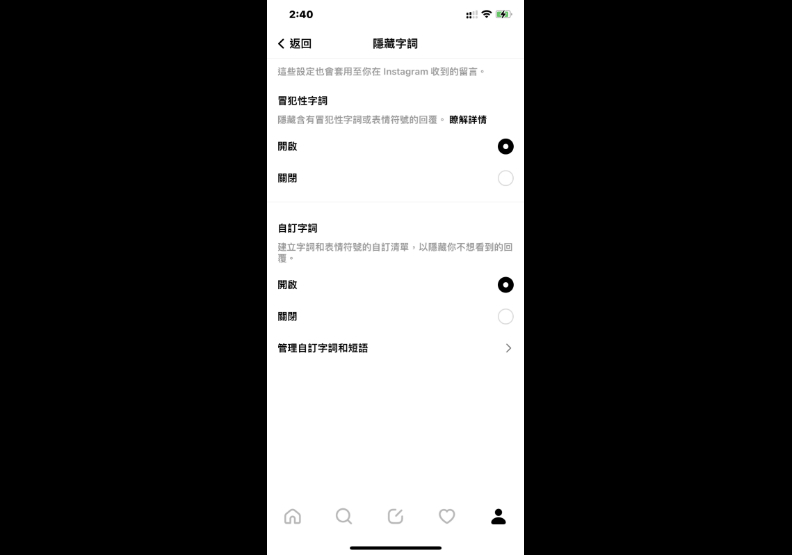
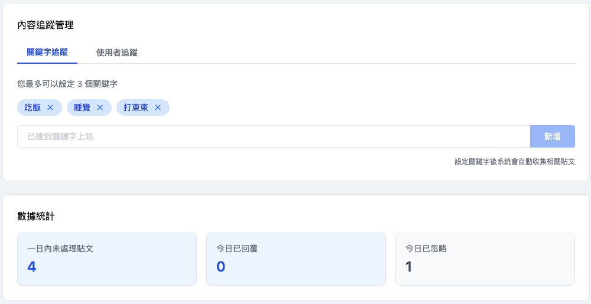
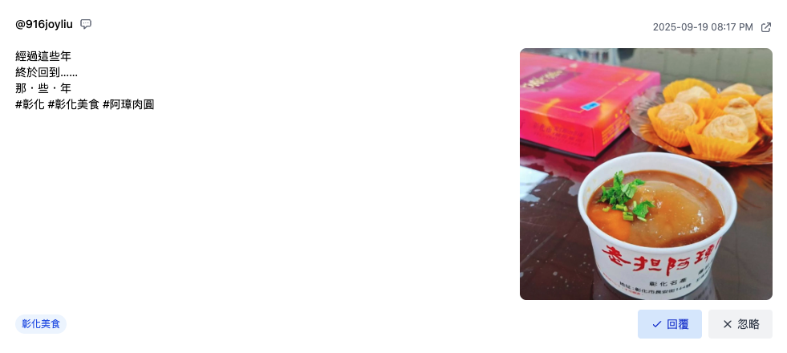

+++
title = '在脆 Threads 上看見想看見的'
date = 2025-09-05T18:08:07+01:00
draft = false
cover = { image = "cover.png" }
+++
知道很多使用者其實不喜歡 **Threads 的演算法**，常常滑段時間後會覺得上面的發言比較偏頗，也許今天的你心血來潮希望看些有深度的內容，卻容易被迷因梗圖吸引注意力，回過神就突然發現版面上都是 Rickrolling，相信我這並不是你的錯，但其實也不是 **Threads 演算法**的錯。

很多創作者嘗試過訓化 Threads 演算法，比如說盡可能的只閱讀英文內容或只和英文語系創作者互動，可惜結果都是只能維持一段時間，很快地又會因為自己的注意力回到 Rickrolling 。

## 只能隨著 Threads 的演算法內容娛樂化嗎？

以下提供幾個方法讓你能確定的掌握自己希望看見的內容。

### 善用 Threads 的隱藏字詞

脆其實有個隱藏字詞的功能，可以過濾包含這些文字的串文，舉例我們觀察到台灣使用者普遍不太喜歡蝦皮的分銷連結，就可以設定「s.shopee.」作為隱藏字詞，那脆將精準隱藏包含蝦皮分銷連結的相關串文。

功能位置在脆的「**設定**」→ 「**內容偏好設定**」→ 「**隱藏字詞**」。

### 滑串文前發篇串文

這個是比較少人提及，但經測試也是蠻有效的方法，就是在滑串文前發篇自己希望關係內容，如果你希望了解人們對於某則重大新聞的看法，那就發篇該則新聞的概要，請注意你不需要表達對這則新聞的觀點，只要分享新聞核心內容，演算法自然會在短時間內推播其他相關串文給你。

順便一提和 Threads 對話基本上效果較不明顯，像是「親愛的脆我希望看見 XXX 相關內容。」的串文經測試沒有特別的效果。

### 只追蹤相關內容的創作者

這個其實也蠻有效的，就是只追蹤你感興趣的內容創作者，每次都切換到追蹤中的標籤閱讀，但是，人生最難過的就是這個但是！

只有追蹤中的標籤是不夠的，當追蹤的創作者較多時串文同樣會不受控的隨機排序顯示，更別提脆的關鍵字標籤釘選功能，也經常出現看起來和追蹤關鍵字無關的串文。

## 利用第三方工具找回注意力

為此 **Pitchat** 最新推出 Threads 的「**貼文探索**」，目前功能正處於測試階段，功能的目標是希望可以在沒有 Threads 演算法干擾的前提下，讓使用者盡可能最有效率的閱讀的目標串文。

現在最多可以同時追蹤三個 **Threads 串文關鍵字**以及三位 Threads 創作者的最新串文，Pitchat 的**貼文探索**會每隔一段時間自動透過官方提供的資料串接搜尋相關串文，並只保留顯示 72 小時內發出的串文。

最重要的是可以標記是否已回覆或已忽略該串文，記錄每天的閱讀數量，而非盲目的重新整理等待 Threads 餵食內容。

由於官方串接資料現階段還存有許多限制，我們會盡力往核心目標靠近，如果大家有任何使用上的建議也請不吝嗇的聯繫我們給予建議。