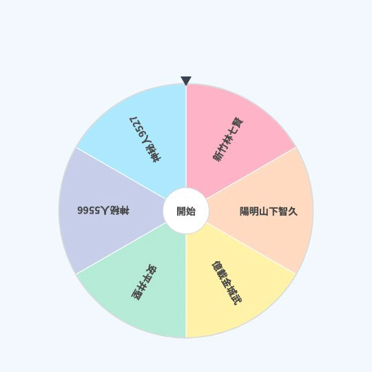
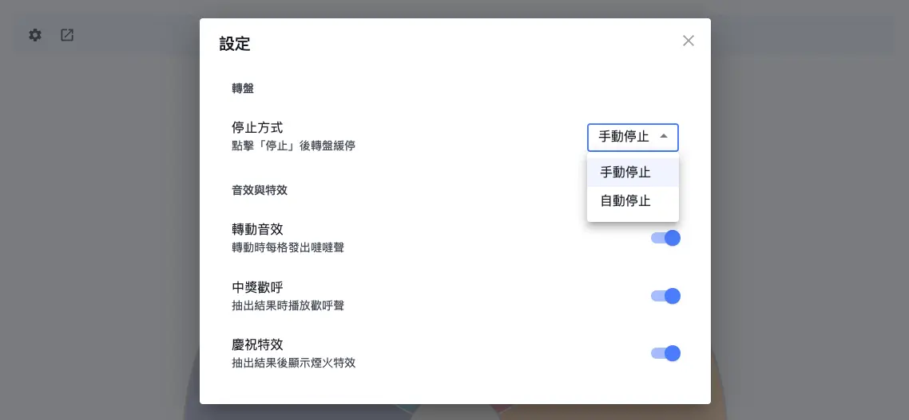
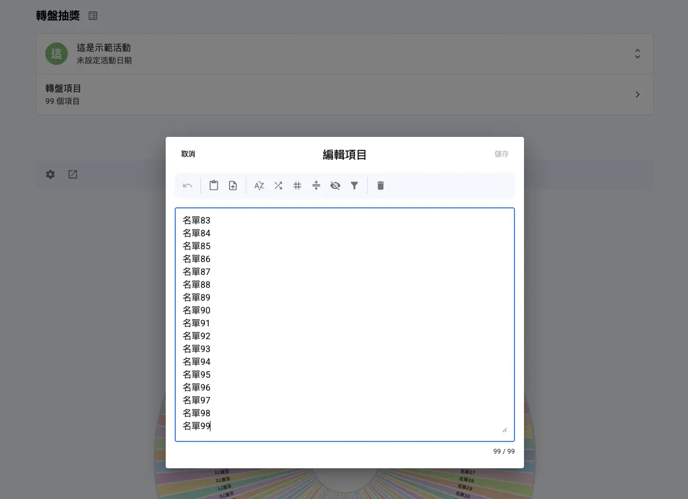
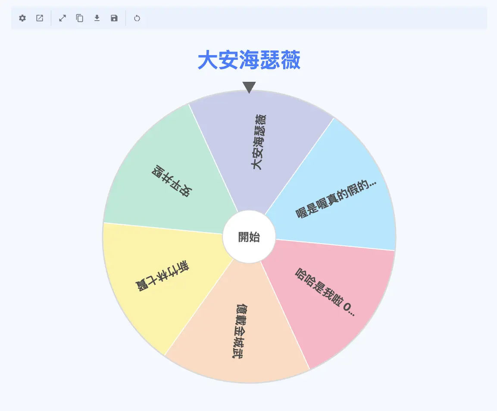

+++
title = '轉盤抽獎免費工具教學｜隨機轉盤、隨機抽籤一鍵搞定'
description = '轉盤抽獎怎麼用？本文介紹隨機轉盤與隨機抽籤的常見情境，並示範如何用 Pitchat 免費工具完成直播抽獎與日常隨機選擇，搭配音效特效與投影視窗，讓抽籤更有現場感。'
date = "2026-06-07T10:00:00+08:00"
draft = false
cover = { image = "cover.webp" }
+++

直播到一半想抽個幸運觀眾，卻臨時找不到順手的工具？或是和同事討論半天「中午到底要吃什麼」，誰都不想做決定？這些「需要隨機選一個」的時刻，其實用一個**轉盤抽獎**工具就能輕鬆解決。把所有選項放進一個會旋轉的圓盤，按下開始、等待慢慢停下——比起閉著眼睛點名單，這個過程更有儀式感。

這篇文章會帶你了解**轉盤抽獎、轉盤抽籤、隨機轉盤、隨機抽籤**這類工具到底怎麼用、適合哪些情境，並實際示範如何用 **[Pitchat 轉盤抽獎](https://app.pitchat.co/spin-wheel?r=blog&utm_source=blog&utm_medium=blog&utm_campaign=spin-wheel-random-picker-guide)** 在幾分鐘內完成一場小型抽籤。無論你是實況主、小編、活動主辦人，還是只是想擺脫選擇困難，都能找到適合自己的用法。

## 什麼是轉盤抽獎？和隨機抽籤有什麼關係

**轉盤抽獎**的概念很單純：把你想抽的項目（人名、選項、號碼）平均分配到一個圓盤的各個扇形格子裡，旋轉之後讓指針隨機停在某一格，那一格就是這次的結果。

它其實就是把「隨機抽籤」這件事視覺化。同樣是隨機選一個，紙籤是抽出來才知道，而**隨機轉盤**讓你能親眼看著它轉、看著它停——所以這類工具也常被稱為**轉盤抽籤**或**隨機抽籤**工具，名稱不同，本質都是「讓程式隨機選出一個」。

和直接報名單相比，轉盤抽獎有三個比較實際的好處：

- **直覺視覺化**：所有選項一眼看完，過程公開透明，旁觀者也看得懂。
- **過程有儀式感**：旋轉與停下的那幾秒鐘製造期待感，特別適合需要炒熱氣氛的場合。
- **隨機機制減少爭議**：由程式隨機決定停在哪一格，而不是由人主觀挑選，減少「黑箱」的疑慮。

## 什麼情境適合用隨機轉盤？

隨機轉盤的用途比想像中廣，以下依實際常見程度排序，看看哪一種最符合你的需求。

### 1. 直播抽獎（最常見用法）

這大概是轉盤抽獎最受歡迎的場景。實況主在 YouTube、Twitch、Instagram、Facebook 直播時，把參與觀眾的名字輸入轉盤，現場旋轉抽出幸運兒。搭配旋轉音效與中獎特效，能瞬間拉高直播的互動氣氛；用投影/分享畫面的方式，線上觀眾也能一起看著轉盤停下，過程公開又熱鬧。

> **小提醒**：轉盤抽獎每一次旋轉都是獨立的，所有項目機率均等，因此同一個人有可能在不同次被重複抽到。如果你需要「一次抽出多位、且彼此不重複」的得獎者，建議改用後面會介紹的[自訂名單抽獎](https://app.pitchat.co/lucky-draw?r=blog&utm_source=blog&utm_medium=blog&utm_campaign=spin-wheel-random-picker-guide)。

### 2. 選擇困難救星：今天吃什麼、去哪玩、要不要

這是隨機轉盤最日常、也最具代表性的用法。中午不知道吃什麼，把附近幾間店輸進去轉一下；週末不知道去哪，把口袋名單丟進轉盤；連「要不要再來一杯」這種小糾結，都能交給轉盤幫你定案。一轉之間，省下反覆討論的時間。

### 3. 活動抽幸運兒

尾牙、年會、週年慶、社團聚會等場合的小型現場抽獎，把參加者名字放進轉盤，當場旋轉開獎。對於項目不多、講求現場氣氛的活動來說，轉盤抽獎的視覺效果比念名單更有看頭。

### 4. 其他輕量場景

聚會時用來決定「誰先上台」「誰請客」，或是老師在課堂上隨機點名、抽人回答問題，這些臨時、輕量的隨機需求，轉盤抽籤也都能勝任。

## Pitchat 轉盤抽獎的特色功能

了解情境之後，來看看 Pitchat 的轉盤抽獎實際提供哪些功能，以及它們在使用上的價值。

我們在觀察了許多直播主與活動主辦人的抽獎流程後發現，大部分人最在意的不是花俏的介面，而是「觀眾看得到過程、結果信得過」。這也是我們在設計轉盤時，選擇將隨機運算完全放在使用者裝置上執行的原因——以下幾項功能，都是圍繞這個核心需求來打造的。

### 本機加密隨機運算

轉盤的結果由瀏覽器內建的加密等級隨機演算法決定，所有運算都在你自己的裝置上執行、不經過伺服器。每一次旋轉都是獨立計算、結果不可預測，有助於維持抽籤的隨機性與可信度。

### 手動停止與自動停止兩種模式

你可以依場合選擇停止方式：

- **手動停止**：點擊「停止」（或轉盤中心圓）後，轉盤會緩緩減速停下。適合想自己掌握停下時機、製造張力的場合，例如直播抽獎前先和觀眾倒數。
- **自動停止**：開始後轉盤會自動旋轉數秒再停下。適合需要快速連續抽好幾次的情況。

### 音效與慶祝特效

轉盤提供三種可自由開關的效果：轉動時的「噠噠」音效、抽出結果時的中獎歡呼，以及結果出現後的煙火特效。在直播或現場活動中打開這些效果，氣氛會明顯不同；不需要時也能一鍵關閉，保持安靜。

### 投影視窗與名單同步

工具列提供「跳出投影視窗」，可以把轉盤開在獨立的大畫面，方便投影到螢幕或在直播中分享，讓現場觀眾或線上觀眾都能清楚看到旋轉過程。登入後建立的轉盤活動也會自動保存，活動當天臨時換電腦也不用重新建名單，直接登入就能接著用。

### 結果保存

每次抽出的結果都會記錄在「歷史中獎名單」裡。你可以隨時複製名單、匯出成 CSV，或儲存中獎名單——省去事後逐一回想中獎者的麻煩，也方便直接用來通知得獎者或留存備查。

> 目前已有不少直播主與社群小編在直播抽獎、粉絲互動活動中使用 Pitchat 轉盤。如果你在使用過程中有任何回饋或建議，歡迎透過網站內的聯繫管道告訴我們，我們會持續根據實際使用場景來優化功能。

## 3 步驟開始你的轉盤抽獎

整個流程很簡單，第一次使用也能在幾分鐘內上手。

### Step 1：登入並建立活動

前往 [Pitchat 轉盤抽獎](https://app.pitchat.co/spin-wheel?r=blog&utm_source=blog&utm_medium=blog&utm_campaign=spin-wheel-random-picker-guide)，用 Email 收取一次性密碼（OTP）即可快速登入，接著建立一個轉盤活動。

### Step 2：輸入轉盤項目

打開項目編輯框，輸入你要抽的內容。支援三種方式：

- **手動輸入**：每行一個項目。
- **複製貼上**：從 Excel 或其他文件貼上整份名單。
- **拖曳檔案**：直接把 CSV 或 TXT 檔拖進來。

項目之間可用換行、逗號或分號分隔，單一轉盤最多支援 **99 個項目**。

### Step 3：旋轉並查看結果

選好「手動停止」或「自動停止」後，按下開始旋轉。指針停下時就會顯示這次抽出的項目，接著你可以複製、匯出或儲存結果。想再抽一次，直接再轉即可。

## 轉盤抽獎 vs 自訂名單抽獎，該用哪個？

Pitchat 同時提供「轉盤抽獎」與「自訂名單抽獎」兩種工具，適合的場景不太一樣：

| 比較項目 | 轉盤抽獎 | 自訂名單抽獎 |
| --- | --- | --- |
| 項目／人數上限 | 最多 99 個項目 | 最多 10,000 人 |
| 多組獎項設定 | 不支援 | 支援多組獎項 |
| 一次抽多位不重複 | 不適用（每轉獨立、可能重複） | 支援自動排除已中獎者 |
| 視覺特色 | 旋轉動畫、儀式感強 | 多種顯示模式、進階篩選 |
| 適合場景 | 小型、即時、現場互動 | 中大型、規則較嚴謹的活動 |

簡單來說：**項目少、講求現場氣氛、即時隨機**就用轉盤抽獎；**人數多、需要多組獎項或避免重複中獎**，就用 [自訂名單抽獎](https://app.pitchat.co/lucky-draw?r=blog&utm_source=blog&utm_medium=blog&utm_campaign=spin-wheel-random-picker-guide)。想完整了解後者，可以參考這篇 [免費線上抽獎系統指南](https://app.pitchat.co/lucky-draw?r=blog&utm_source=blog&utm_medium=blog&utm_campaign=spin-wheel-random-picker-guide)。

## 常見問題 FAQ

### Q1：轉盤抽獎最多支援幾個項目？

最多支援 **99 個項目**。如果你的名單超過這個上限，建議改用自訂名單抽獎，最多可支援一萬人。

### Q2：轉盤抽獎需要付費嗎？

目前免費使用。由於項目數量在 99 個以內，抽獎演算法直接在你的裝置上執行，不消耗任何抽獎次數。

### Q3：「手動停止」和「自動停止」有什麼差別？

手動停止是點擊「停止」（或轉盤中心圓）後，轉盤緩緩停下並顯示結果，適合想自己掌控時機的場合；自動停止則是開始後旋轉數秒再自動停下，適合快速連續抽籤。

### Q4：轉盤抽籤的結果是隨機的嗎？公平嗎？

轉盤採用瀏覽器內建的加密等級隨機演算法，運算在你的裝置本機執行、不經由伺服器。每一格的機率均等、結果不可預測且每次獨立計算，有助於維持抽籤的隨機性。實際體驗依使用情境而異。

### Q5：同一個人會被重複抽中嗎？

會。轉盤每次旋轉都是獨立事件，所有項目機率相同，因此同一個項目可能在不同次被重複抽到。若你需要一次抽出多位、且彼此不重複的得獎者，建議改用自訂名單抽獎。

### Q6：抽獎記錄要怎麼保存？

你可以在「展開抽獎結果」查看本次的完整記錄，也可以複製名單、匯出 CSV 或儲存中獎名單。

## 結論

轉盤抽獎把「隨機選一個」這件事變得直覺又有看頭——從直播抽幸運觀眾、活動現場開獎，到日常的「今天吃什麼」，一個**隨機轉盤**就能搞定。Pitchat 轉盤抽獎目前免費使用、支援最多 99 個項目，搭配手動／自動停止、音效特效與投影視窗，很適合需要即時、現場感的小型抽籤。

如果你的活動規模更大、需要多組獎項或避免重複中獎，再搭配自訂名單抽獎即可。

下次直播前想炒熱氣氛，或午餐又陷入選擇困難時，不妨打開 Pitchat 轉盤試試——幾分鐘就能搞定一場有儀式感的隨機抽籤。

**👉 [免費使用 Pitchat 轉盤抽獎](https://app.pitchat.co/spin-wheel?r=blog&utm_source=blog&utm_medium=blog&utm_campaign=spin-wheel-random-picker-guide)**

---

### 延伸閱讀

- [自訂名單抽獎](https://app.pitchat.co/lucky-draw?r=blog&utm_source=blog&utm_medium=blog&utm_campaign=spin-wheel-random-picker-guide) — 最多一萬人、支援多組獎項
- [Instagram 抽獎工具](https://app.pitchat.co/instagram?r=blog&utm_source=blog&utm_medium=blog&utm_campaign=spin-wheel-random-picker-guide) — IG 留言抽獎
- [Facebook 抽獎工具](https://app.pitchat.co/facebook?r=blog&utm_source=blog&utm_medium=blog&utm_campaign=spin-wheel-random-picker-guide) — 粉專貼文抽獎
- [Threads 抽獎工具](https://app.pitchat.co/threads?r=blog&utm_source=blog&utm_medium=blog&utm_campaign=spin-wheel-random-picker-guide) — 脆抽獎
- [YouTube 抽獎工具](https://app.pitchat.co/youtube?r=blog&utm_source=blog&utm_medium=blog&utm_campaign=spin-wheel-random-picker-guide) — YT 影片留言抽獎