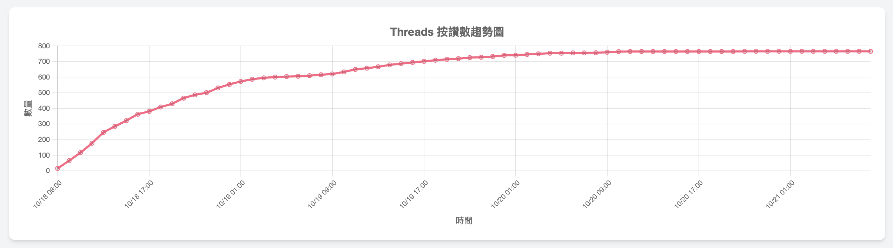
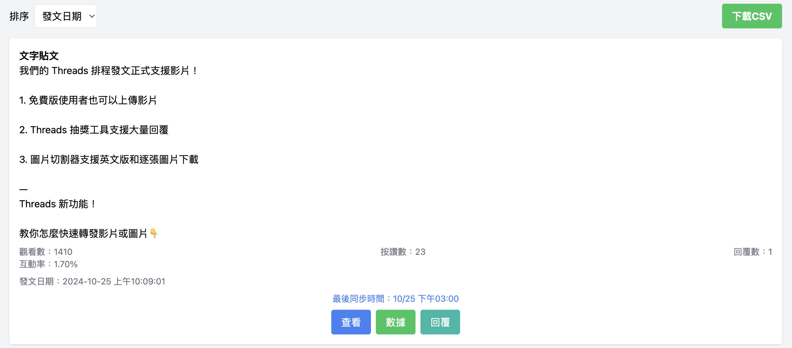
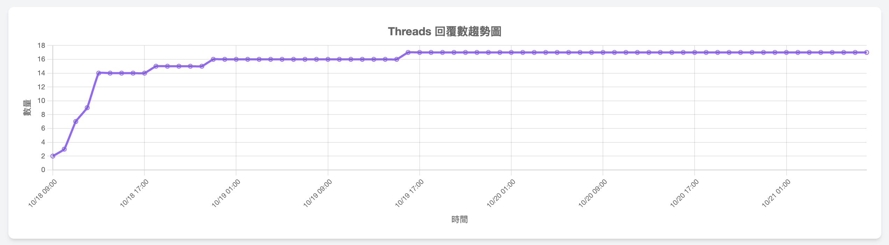
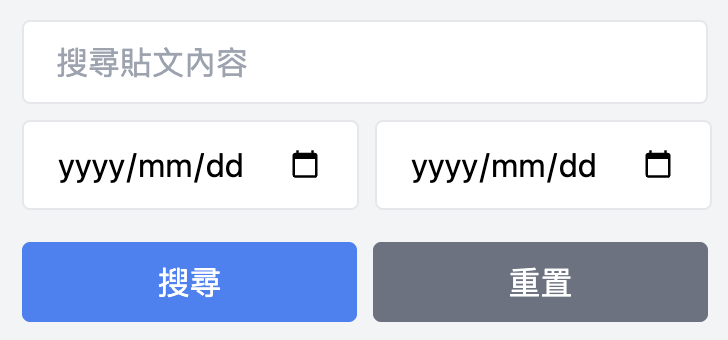
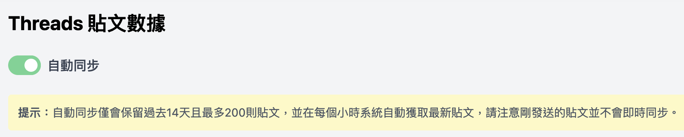

+++ 
title = 'Threads 數據分析：提升您的社交媒體策略' 
date = 2024-10-25T12:07:07+01:00 
draft = false 
cover = { image = "views.png" } 
+++

Threads 最近推出了官方的數據洞察功能，雖然提供的數據很有限，但這對於希望深入分析數據的用戶來說，無疑是一個重要的進展。本文將探討如何利用這些數據來優化您的社交媒體策略，特別是針對 Threads 數據分析 的應用。

## 什麼是 Threads 數據洞察？

Threads 的數據洞察功能允許用戶查看與其個人資料相關的多項指標。這些指標不僅可以幫助您了解受眾的互動情況，還能為您的內容策略提供寶貴的數據支持。

## 可用的數據指標

* **個人資料訪問次數** 用戶可以選擇查看過去 7 天、14 天、30 天或 90 天內的資料訪問次數。這個指標能夠直接反映在短期內的曝光率。
* **互動率** 數據洞察還提供粉絲與非粉絲之間的互動率，讓您了解不同受眾對您內容的反應。

* **追蹤數成長** 監測您的追蹤者數量變化，這有助於您評估市場策略的有效性。
* **粉絲受眾組成** 了解您的粉絲群體特徵，從而調整內容以更好地滿足他們的需求。

## 深入數據分析的必要性

對於專業的行銷人員來說，以上數據可能還不夠全面。您可能希望知道哪些貼文在過去七天內表現優異，或是在哪些時段內貼文的觀看次數較高。這時，進一步的數據分析就顯得尤為重要。

## 使用 Pitchat 進行進階數據分析

為了滿足更深入的分析需求，您可以使用 Pitchat 貼文數據。這個工具提供發文後72小時內每小時更新的貼文成長數據，包括：

* **觀看人數**
* **按讚數**
* **回覆數**

此外，Pitchat 將收集過去14天內的所有貼文數據，並根據不同的時間範圍進行排序，幫助您識別最佳表現的內容。

## 數據下載與整理

最重要的是，Pitchat 還提供貼文數據的 CSV 下載功能，讓您能夠進一步進行細緻的數據分析。您甚至可以一次性下載過去的所有貼文，方便進行整理和長期跟蹤。

## 結論

Threads 的數據洞察功能為用戶提供了強大的數據支持，特別是對於那些尋求提升社交媒體策略的行銷專業人士。透過深入的數據分析，您可以更好地理解受眾需求，優化內容策略，最終達成行銷目標。

利用 Threads 數據分析，讓您的社交媒體表現更上一層樓！