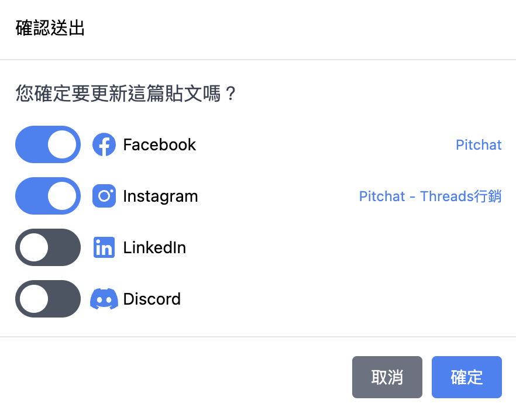
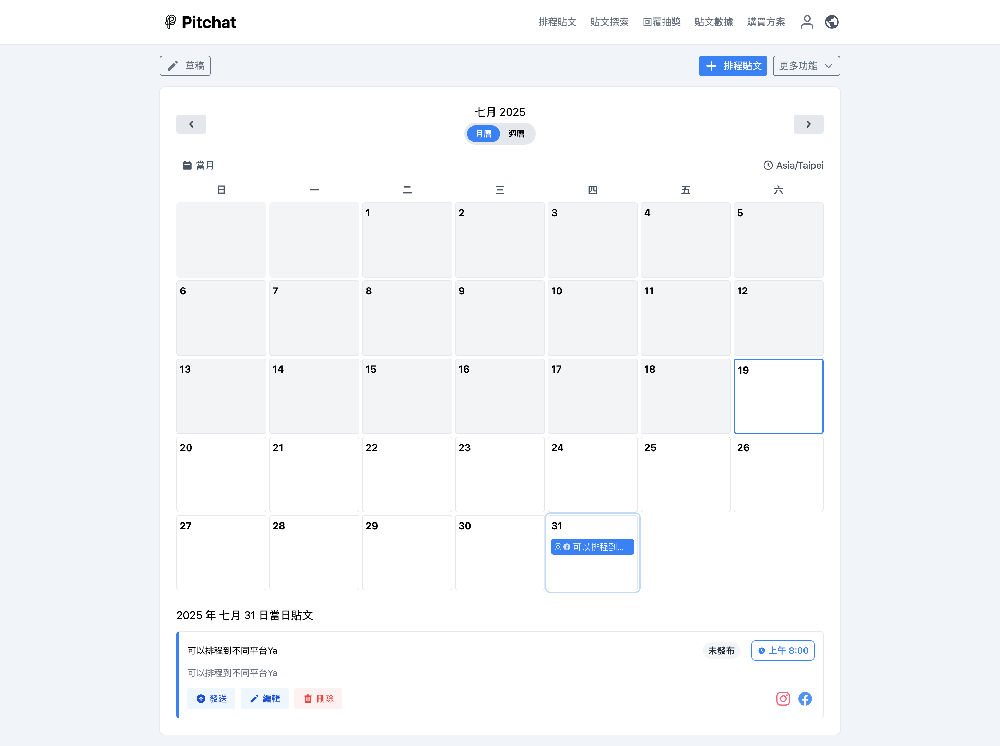
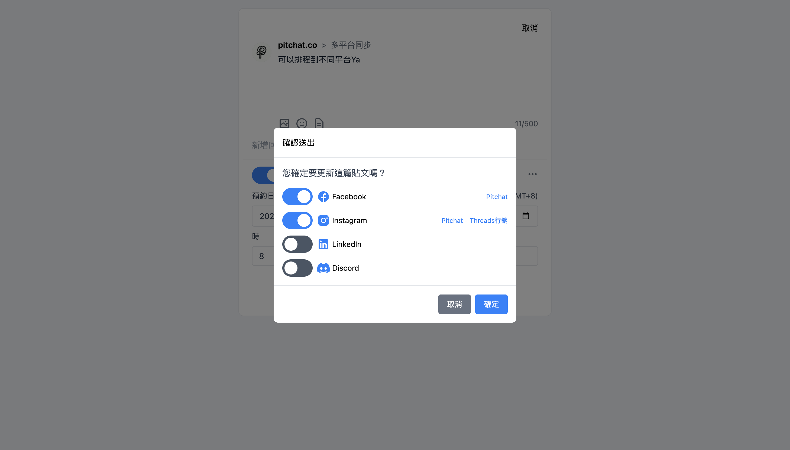
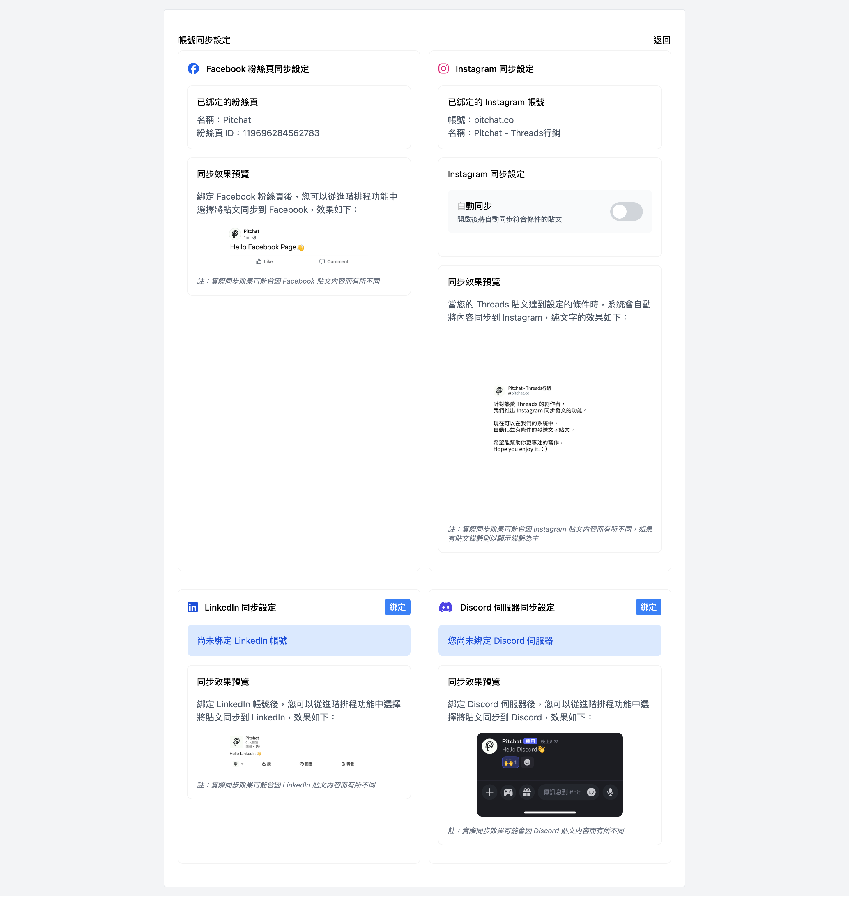

+++
title = 'Threads Instagram同步發文：輕鬆掌握跨平台社群經營秘訣'
date = 2025-07-15T08:07:07+01:00
draft = false
cover = { image = "image3.png" }
+++
還在為多平台發文煩惱？學習如何使用 Pitchat 將 Threads 內容一鍵同步到 Instagram、Facebook 等平台。本篇提供完整教學、規則詳解與進階技巧，大幅提升您的社群經營效率。

---

## **還在手動複製貼上？用 Pitchat 實現 Threads Instagram 同步發文，效率翻倍！**

身為社群管理者、內容創作者或品牌經營者，您是否也覺得在不同社群平台間切換、重複發布相同內容，既耗時又繁瑣？特別是在 Threads 興起後，如何將上面的精彩內容快速分享到 Instagram、Facebook 等既有平台，成為了一大挑戰。

別擔心！**Pitchat** 的「**多平台自動同步發文**」功能就是您的最佳解決方案。您只需要在 Threads 發布一次貼文，就能將內容即時同步至 Instagram、Facebook、LinkedIn 和 Discord。這不僅能大幅節省您的寶貴時間，更能有效提升內容曝光，讓您的社群經營事半功倍！

### **為什麼你需要 Threads 跨平台同步發文？Pitchat 的核心優勢**

在深入教學前，讓我們先了解為什麼這個功能如此強大：

- **節省時間，提升效率：** 只需一次操作，內容自動分發，告別手動複製貼上的惡夢。
- **擴大觸及，增加曝光：** 輕鬆觸及不同平台的受眾，讓您的優質內容被更多人看見。
- **維持品牌一致性：** 確保所有平台的訊息同步，建立穩定、專業的品牌形象。
- **操作直覺簡單：** 無需複雜設定，在發文介面勾選即可，帳號綁定一次搞定。

### **一圖看懂！Pitchat 同步發文介面與操作指南**

Pitchat 的介面設計非常直觀，即使是第一次使用也能快速上手。

1. **編輯貼文：** 在 Pitchat 的介面撰寫您的 Threads 貼文。
2. **選擇平台：** 在編輯區下方，您會看到所有已綁定的平台圖示（包含 Instagram、Facebook 等）。
3. **一鍵啟用：** 只需用滑鼠**點擊您想同步的平台圖示**，例如點亮 Instagram 的圖示。
4. **發布內容：** 按下發送後，Pitchat 就會自動將您的貼文同步到所有選定的平台。

### **首次設定必看：Threads Instagram 帳號綁定教學**

在享受一鍵同步的便利前，您需要先完成帳號綁定。別擔心，過程非常簡單：

- **步驟一：進入綁定頁面**
  首次使用時，系統會自動引導您至帳號綁定頁面。您也可以在設定中找到此選項。
- **步驟二：安全授權**
  點擊欲綁定的平台（如 Instagram），頁面將跳轉至官方授權登入頁面。**所有授權過程皆在官方平台完成，Pitchat 不會儲存您的密碼，確保帳號安全。**
- **步驟三：驗證與確認**
  完成授權後，系統會自動返回 Pitchat 並顯示「已連接」狀態，代表您的 Instagram 已成功綁定！

### **發文前必讀：各平台同步規則詳解**

由於每個社群平台的媒體格式與字數限制不同，了解同步規則能幫助您更順利地發布內容。

| 平台 | 圖片支援 | 影片支援 | 圖片+影片混合 | 備註 |
| --- | --- | --- | --- | --- |
| **Threads** | ✅ | ✅ | ✅ | 內容的來源平台。 |
| **Instagram** | ✅ | ✅ | ✅ | 圖片/影片擇一。詳細規則請參考 [Instagram 同步發布](https://www.google.com/search?q=%23) |
| **Facebook** | ✅ | ✅ | ❌ | 混合內容**優先同步影片**。 |
| **LinkedIn** | ✅ | ✅ | ❌ | 混合內容**優先同步影片**。 |
| **Discord** | ✅ | ❌ | ❌ | **僅同步圖片**，影片會被忽略。 |

**重點提醒：** 當您在 Threads 的貼文同時包含圖片和影片時，同步到 Instagram、Facebook 和 LinkedIn 將會以**影片**為優先，或可能導致發布失敗。

### **常見問題 (FAQ)：解決你的同步疑難雜症**

**Q1：為什麼我的貼文同步到 Instagram 失敗了？**

- **授權過期：** 請至帳號綁定頁面，檢查 Instagram 的授權狀態是否正常，必要時請重新授權。
- **格式不符：** Instagram 對影片的長度、尺寸有嚴格要求。請確認您的影片符合 [IG 的規範](https://www.google.com/search?q=%23&authuser=3)。

**Q2：我該如何優化我的跨平台貼文內容？**

- **通用性原則：** 撰寫內容時，先以「所有平台都能看」為原則，避免使用僅限單一平台的功能。
- **定期檢查：** 發布後可抽查各平台的同步狀況，確保內容如預期般顯示，並根據觸及率數據調整您的發布策略。

### **準備好讓社群經營事半功倍了嗎？**

掌握了 **Threads 多平台同步發文**的技巧，您就能將更多時間投入到真正重要的事情上——創造更優質的內容、與您的粉絲互動。

**立即開始使用 Pitchat，體驗前所未有的社群管理效率！**

[👉 點此免費試用 Pitchat，開啟高效社群同步之旅！](https://www.google.com/search?q=%23&authuser=3)