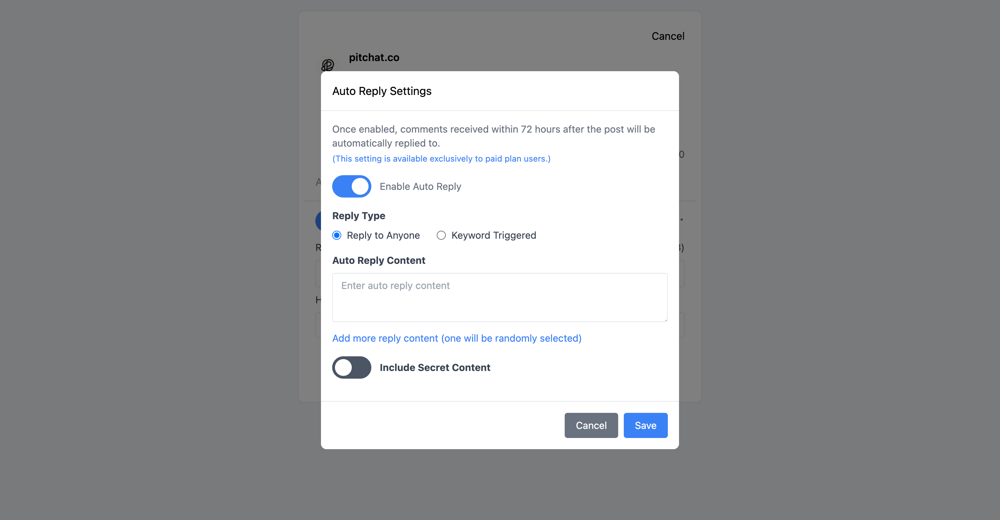
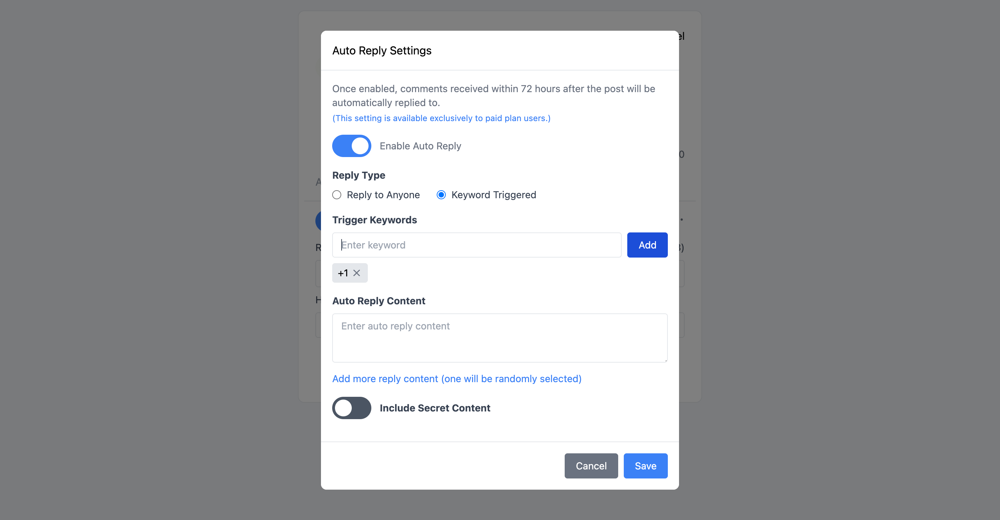
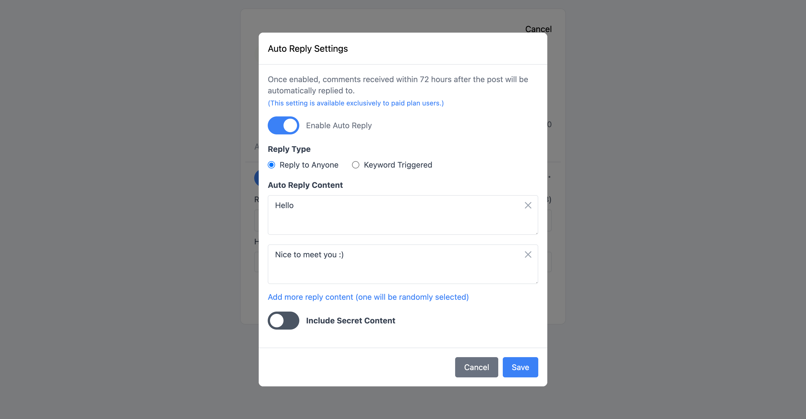
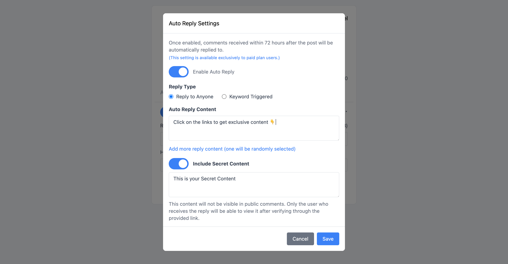

+++
title = 'Threads (脆) 關鍵字自動回覆：提升互動效率的智能解決方案'
date = 2025-04-02T08:07:07+08:00
draft = false
cover = { image = "threads-auto-reply-cover.png" }
+++

在現今競爭激烈的社群媒體環境中，**Threads (脆) 關鍵字自動回覆**功能已成為提升帳號互動率的必備工具。Pitchat 的自動回覆功能讓您即使不在線上，也能與粉絲保持良好互動，有效提升帳號活躍度和參與度。

## 什麼是 Threads 自動回覆機器人？

Threads 自動回覆機器人是一種智能化工具，能夠在您發佈貼文後的 72 小時內，自動回應用戶的留言。這項功能不僅節省了您的時間，更重要的是確保了與粉絲之間的即時互動，大幅提升社群媒體的經營效率。

> **重要提醒：** 此功能僅對升級為付費方案的使用者開放。

## Threads 自動回覆的核心優勢

### 1. 24/7 不間斷互動
即使您在睡覺或忙碌時，機器人仍能持續與粉絲互動，確保不錯過任何互動機會。

### 2. 提升帳號參與度
系統會在發文後 72 小時內自動回覆，有效維持帳號的活躍度，提升 Threads 演算法的推薦機會。

### 3. 個性化回覆體驗
支援多種回覆模式，讓您的自動回覆更加自然且具有個人特色。

## 四大自動回覆模式詳解

### 回覆所有人模式

這是最基礎的自動回覆模式，適合進行普通的感謝或通用回應。無論粉絲留下什麼內容，系統都會自動回覆預設的訊息。

**適用場景：**
- 感謝留言
- 通用問候
- 基礎互動回應

### 關鍵字觸發模式

**Threads 關鍵字自動回覆**的核心功能，僅在留言包含特定關鍵字時才觸發回覆。這種精準的回覆機制讓您能夠：

- 設定多個關鍵字，靈活應對不同類型的留言
- 使用簡便的關鍵字管理介面
- 針對特定議題提供專業回應

**設定範例：**
- 關鍵字：「教學」→ 回覆：「感謝您的興趣！我會持續分享更多實用教學內容 📚」
- 關鍵字：「合作」→ 回覆：「歡迎私訊討論合作機會！」

### 隨機回覆內容

為了避免回覆內容過於單調，系統支援添加多個回覆內容，並隨機選擇其中一個進行回覆。這項功能能夠：

- 提升回覆的自然度
- 避免被識別為機器人回覆
- 增加互動的趣味性

**建議設定：**
- 準備 3-5 個不同但意思相近的回覆內容
- 加入適當的表情符號增加親和力
- 定期更新回覆內容保持新鮮感

### 秘密內容功能

這是 Pitchat 獨有的進階功能，允許您設定不會在公開回覆中顯示的秘密內容。內容將以連結形式在回覆中提供，只有點擊連結並通過 Threads 驗證登入的用戶才能查看。

**應用場景：**
- 提供獨家資源下載連結
- 分享會員專屬內容
- 建立私密社群邀請

## 如何設定 Threads 關鍵字自動回覆

### 步驟 1：升級付費方案
首先確保您已升級至 Pitchat 付費方案，才能使用自動回覆功能。

### 步驟 2：設定回覆模式
根據您的需求選擇合適的回覆模式：
- 新手建議先從「回覆所有人」模式開始
- 有經驗的用戶可直接使用「關鍵字觸發」模式

### 步驟 3：編寫回覆內容
- 準備多樣化的回覆內容
- 確保內容符合您的品牌調性
- 加入適當的 call-to-action

### 步驟 4：測試與優化
- 發佈測試貼文驗證功能
- 觀察用戶反應並調整設定
- 定期更新關鍵字和回覆內容

## 回覆管理與優化

在回覆管理頁面中，您可以隨時更新自動回覆的設定，包括：

- 新增或刪除關鍵字
- 修改回覆內容
- 調整觸發條件
- 查看回覆統計數據

## 最佳實踐建議

### 1. 關鍵字設定策略
- 選擇與您內容相關的核心關鍵字
- 避免過於廣泛的關鍵字導致誤觸發
- 定期分析留言內容，調整關鍵字清單

### 2. 回覆內容優化
- 保持友善和專業的語調
- 適度使用表情符號增加親和力
- 避免過於商業化的內容

### 3. 互動數據監控
- 定期檢查自動回覆的效果
- 觀察粉絲對自動回覆的反應
- 根據數據調整策略

## 常見問題解答

**Q: 自動回覆會被 Threads 識別為垃圾訊息嗎？**
A: Pitchat 的自動回覆功能經過精心設計，符合 Threads 的使用規範，不會被識別為垃圾訊息。

**Q: 可以設定回覆的時間間隔嗎？**
A: 系統會自動控制回覆頻率，避免過於頻繁的回覆影響用戶體驗。

**Q: 如何避免對其他創作者的留言自動回覆？**
A: 可以在關鍵字設定中加入排除條件，避免對特定類型的留言回覆。

## 結論

**Threads (脆) 機器人關鍵字自動回覆**功能是現代社群媒體經營的重要工具。透過 Pitchat 的智能自動回覆系統，您可以：

- 大幅提升與粉絲的互動效率
- 保持帳號 24/7 的活躍度
- 建立更好的粉絲關係
- 有效提升 Threads 帳號的參與度

善用自動回覆功能，讓您的 Threads 帳號在您不在線時仍能保持活躍互動，有效提升粉絲互動率及帳號參與度！[立即升級 Pitchat 付費方案](https://pitchat.co)，開始體驗智能自動回覆帶來的便利吧！
