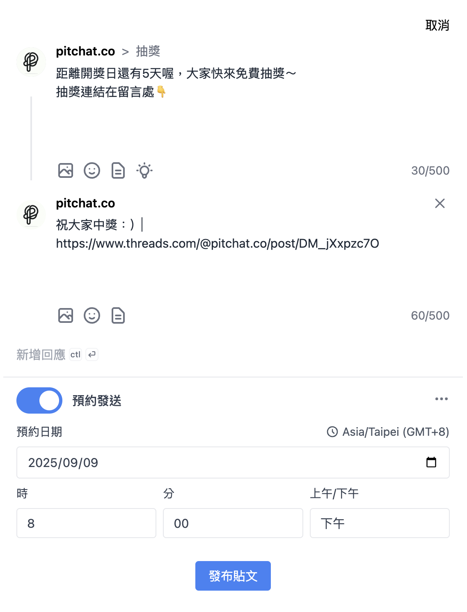
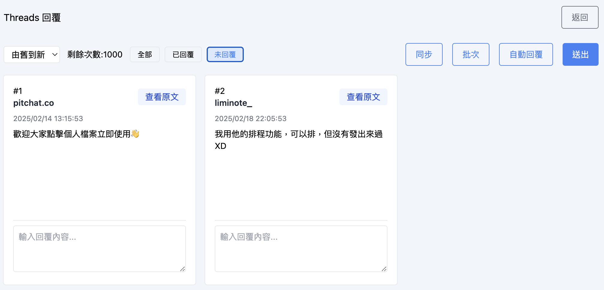

+++
title = '免費公開最新 Threads 抽獎攻略'
date = 2025-09-06T08:08:07+01:00
draft = false
cover = { image = "cover.png" }
+++

想在 Threads 上舉辦抽獎活動卻不知道怎麼開始嗎？別擔心！今天就來分享一些實戰經驗，教你如何設計一場成功的 **Threads 抽獎**活動。

我們觀察了許多品牌和創作者使用 Pitchat 工具舉辦的抽獎活動，發現了一些讓參與度爆棚的小秘訣。不過在開始之前，記得先確認你的獎品符合台灣相關法規喔！如果不確定的話，建議先諮詢法律專家。

## 打造完美 Threads 抽獎的 6 個關鍵動作

### 1. 設定適當的參與門檻

**Threads 抽獎**最基本的玩法就是留言，但你可以讓活動更有趣！比如請大家追蹤你的帳號或分享貼文。不過要注意，如果你同時在多個平台舉辦抽獎，別強迫參與者每個平台都要互動 - 每個平台的受眾不太一樣，讓他們自由選擇反而效果更好。

### 2. 善用「一起中獎」策略

如果你有兩個一樣的獎品（像是兩張演唱會門票），試試看請參與者標記一個朋友一起分享吧！這比單純抽兩個人的效果好太多了，還能增加你的觸及率。

### 3. 增加抽獎透明度

雖然很多人會直接用抽獎工具抽完就公布結果，但我們發現有些參與者會質疑公平性。建議你用專業的第三方 **Threads 抽獎工具**，並且錄影整個抽獎過程 - 這樣不僅增加可信度，也讓你的品牌形象更加專業。

### 4. 開獎前的暖身很重要

開獎前 3-5 天記得每天提醒大家活動即將結束！你可以用排程工具自動發文，保持活動熱度。這樣做真的會讓參與人數明顯增加。

### 5. 別忘了沒中獎的參與者

這點超級重要！會來參加 **Threads 抽獎**活動的人，其實就是你的潛在客戶，建議用批次回覆功能請沒中獎的參與者私訊聯繫，給他們專屬優惠。記住，一定要用私訊，這樣獲得的客群會更精準。

請注意 Threads 目前私訊需要互相追蹤，建議請參與者使用 Instagram 私訊。
專屬優惠也有訣竅，請特別注意優惠的轉化率，最好的方式是在給予專屬優惠的同時告知限時兌換。

### 6. 讓中獎者成為你的代言人

請中獎者分享開箱照片或使用心得吧！這不只讓他們更了解你的產品品質，也能向其他人證明你的抽獎活動是真實可信的。

---

## 如何免費使用 Threads 抽獎工具？

非常感謝大家對我們 **Threads 抽獎工具**的支持！但最近發現有些不肖人士濫用我們的免費服務進行詐騙，這讓我們非常困擾。

為了維護大家的權益，我們調整了使用規則：

**只要你的抽獎貼文同時包含「Threads」、「抽獎工具」和「[https://pitchat.co](https://pitchat.co)」這三個關鍵字，就能直接使用我們的抽獎功能，完全免費！**

希望這個調整能讓真正想舉辦 **Threads 抽獎**的朋友們更方便使用，同時也能有效防止詐騙行為。

準備好開始你的第一場 Threads 抽獎了嗎？快來試試看吧！