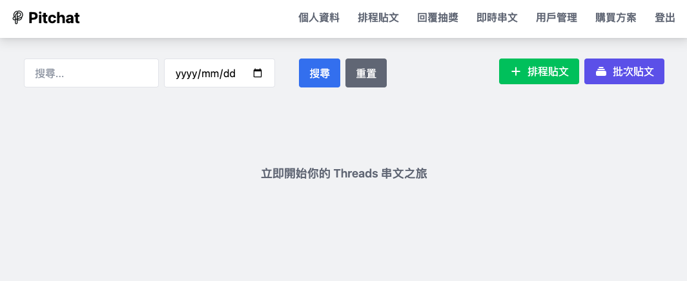

+++
title = 'Threads（脆）排程發文攻略：輕鬆安排貼文時間的秘訣'
date = 2024-09-25T07:07:07+01:00
draft = false
cover = { image = "post-editor.png" }
+++
# Threads（脆）排程發文攻略：輕鬆安排貼文時間的秘訣

你是否也在為 Threads（在台灣暱稱為「脆」）缺少排程發文功能而苦惱？別擔心，本文將為你揭示如何輕鬆實現 Threads 排程發文，讓你的社群經營更上一層樓！

## 為什麼需要 Threads（脆）排程發文？

在快節奏的社群媒體時代，精準的發文時間可以顯著提升貼文觸及率和互動度。雖然 Threads 創辦人馬克·祖克柏曾[承諾開發排程發文功能](https://www.threads.net/@zuck/post/C-srcchPpp7)，但截至 2024 年 9 月 25 日，官方仍未推出此功能。幸運的是，我們找到了完美的解決方案！

## Threads（脆）排程發文步驟指南

### 步驟一：登入 Pitchat 平台

1. 訪問 [Pitchat 官網](https://pitchat.co)。
2. 使用你的 Threads（脆）帳號授權登入。

> 新手小提醒：需要詳細的註冊教學嗎？請查看這篇[Pitchat 註冊指南](https://blog.pitchat.co/posts/how-to-register-pithcat/)。

### 步驟二：進入排程貼文功能

1. 在 Pitchat 平台選單中，找到並點選「貼文列表」。

2. 點擊醒目的「＋排程貼文」按鈕。

### 步驟三：打造吸睛貼文內容

1. 精心撰寫你的貼文標題和內容，記得加入適當的關鍵字和話題標籤。

2. 上傳高質量的圖片或吸引眼球的短影音，提升貼文的視覺吸引力。

3. 善用回應功能，為長文章增添層次感和互動性。

> 專業小技巧：Pitchat 特別為長文章創作者提供了批次編輯功能，讓你的內容管理更加高效！

### 步驟四：智能設定排程時間

1. 根據你的目標受眾活躍時間，精準選擇貼文發布的最佳日期和時間。
2. 注意：如果想即刻發文，只需關閉預約狀態即可。

最後偷偷說設定完排程發文後，還可以設定LINE通知你排程是否有依照預期的時間發出喔。

## Threads（脆）排程發文的優勢

1. **時間管理**：提前安排貼文，釋放寶貴時間專注於內容創作。
2. **一致性**：保持穩定的發文頻率，提升粉絲黏著度。
3. **最佳時機**：針對不同時區的粉絲，在最佳時間點發布內容。
4. **內容品質**：有更多時間打磨內容，確保每篇貼文都達到最高水準。
5. **數據分析**：通過觀察不同時間發布的貼文表現，優化你的內容策略。

## 掌握 Threads（脆）排程發文，成為社群達人

透過 Pitchat 平台，你現在可以輕鬆實現 Threads（脆）排程發文的夢想。無論你是努力經營個人品牌的創作者，還是管理企業社群的專業人士，這個強大的工具都能幫助你更有策略地規劃和發布內容，大幅提升你在 Threads 平台上的影響力。

立即開始使用 Pitchat 進行 Threads（脆）排程發文，讓你的社群經營更上一層樓！掌握這個技巧，你將成為 Threads 平台上的佼佼者，吸引更多粉絲，創造更大的社群價值。

別再等待了，現在就開始你的 Threads（脆）排程發文之旅，讓你的內容在最恰當的時機綻放光彩！