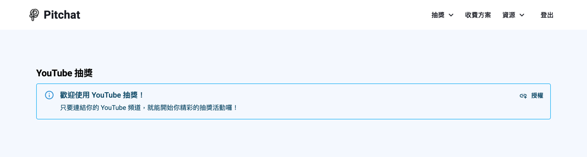

+++
title = '【2025 YT 抽獎神器】YouTube 留言抽獎工具推薦！創作者必備！'
date = 2025-09-07T08:08:07+02:00
draft = false
cover = { image = "cover.png" }
+++

身為 YouTube 創作者，你一定知道抽獎活動是提升頻道互動的利器。無論是慶祝訂閱里程碑、新影片上線，還是回饋忠實觀眾，YT 抽獎都能有效帶動留言數與觀看時間。

但當留言湧入時，問題來了：**要怎麼公平地抽出中獎者？**

手動複製留言到 Excel 抽獎？太累了。用免費工具？又常常卡在留言數量限制。這時候，你需要一款專業的 [YT 抽獎工具](https://app.pitchat.co/youtube?r=blog&utm_source=blog&utm_medium=blog&utm_campaign=youtube-giveaway-tool)。

---

## YouTube 抽獎的 3 種熱門應用場景

許多創作者會在不同時機舉辦 YT 抽獎，以下是最常見的三種場景：

### 1. 訂閱里程碑抽獎

當頻道突破 1 萬、10 萬訂閱時，舉辦抽獎是感謝粉絲支持的好方式。這類活動通常會以「留言」作為參加條件，留言數可能高達數百、數千則。

### 2. 工商合作抽獎

與品牌合作的工商影片中，抽獎是常見的互動形式。透過贊助商提供的獎品進行留言抽獎，不僅能提升影片互動數據，也讓品牌方看到實際的活動成效。

### 3. Shorts 互動抽獎

短影音的留言互動率高，但留言內容較短且雜亂。如果你想從 Shorts 留言中抽獎，需要能過濾無效留言的工具。

---

## 為什麼需要專業 YT 留言抽獎工具？

免費的 YT 抽獎工具雖然方便，但在實際使用時常遇到以下問題：

### 處理效率與穩定性

當留言數量較多時，部分免費工具可能出現無法處理的情況。此外，YouTube API 會不定期調整，免費工具可能因缺乏維護而無法正常使用。

### 操作說明不夠清楚

許多免費工具雖然也有篩選功能，但缺乏完整的操作說明，使用者常常不知道如何正確設定條件。當設定錯誤時，可能導致抽獎結果不符預期。

### 抽獎流程不透明

觀眾無從驗證抽獎是否公平，容易引發質疑。專業的 YT 抽獎系統應該提供透明的抽獎機制，讓結果更有公信力。

---

## Pitchat：透明、高效設計的 YT 抽獎系統

[Pitchat](https://app.pitchat.co?r=blog&utm_source=blog&utm_medium=blog&utm_campaign=youtube-giveaway-tool) 提供了專業的社群抽獎工具，支援 YouTube、Instagram、Threads、Facebook 等多平台。

> 延伸閱讀：[透明的抽獎流程：公平、效率、體驗的最佳化](https://blog.pitchat.co/posts/how-pitchat-makes-lottery-transparent-/)

### 透明公開的抽獎邏輯

Pitchat 的抽獎流程完全公開透明。你的觀眾不需要盲目相信結果，而是可以理解整個抽獎機制，這對建立頻道信任至關重要。

### 處理大量留言不卡頓

針對大量留言資料，Pitchat 採用進階演算法與特別機制，能更有效地處理並建立抽獎名單，讓你順利完成每一場 YT 抽獎活動。

### 一站式多平台支援

除了 YouTube，Pitchat 也支援 [Instagram 抽獎](https://app.pitchat.co/instagram?r=blog&utm_source=blog&utm_medium=blog&utm_campaign=youtube-giveaway-tool)、[Threads 抽獎](https://app.pitchat.co/threads?r=blog&utm_source=blog&utm_medium=blog&utm_campaign=youtube-giveaway-tool)、[Facebook 抽獎](https://app.pitchat.co/facebook?r=blog&utm_source=blog&utm_medium=blog&utm_campaign=youtube-giveaway-tool)。如果你經營多個社群平台，只需一個網站就能進行所有抽獎活動。

---

## YT 留言抽獎教學：三步驟快速上手

使用 Pitchat 進行 YouTube 留言抽獎非常簡單：

### 步驟一：連結 YouTube 頻道

登入 [Pitchat](https://app.pitchat.co?r=blog&utm_source=blog&utm_medium=blog&utm_campaign=youtube-giveaway-tool) 後，進入「[YouTube 抽獎](https://app.pitchat.co/youtube?r=blog&utm_source=blog&utm_medium=blog&utm_campaign=youtube-giveaway-tool)」，依指示授權你的 YouTube 頻道。這是透過官方 API 取得留言資料的必要步驟。

### 步驟二：選擇影片並設定條件

選擇要抽獎的影片後，你可以設定篩選條件，例如：關鍵字、時間範圍、封鎖名單等。也可以設定多個獎項，每個獎項自訂名稱與數量。

### 步驟三：一鍵開獎

確認設定後，點擊「抽獎！」即可抽出幸運得主。中獎名單可一鍵複製，方便你在影片留言區或社群公告。

---

## 讓每一場 YT 抽獎都更專業

抽獎活動是創作者與觀眾互動的重要時刻。使用專業的 YT 抽獎工具，不只是省時省力，更是展現頻道專業度的方式。

**立即使用 [Pitchat YT 抽獎系統](https://app.pitchat.co/youtube?r=blog&utm_source=blog&utm_medium=blog&utm_campaign=youtube-giveaway-tool)**，讓你的下一場 YouTube 抽獎活動更順暢！
